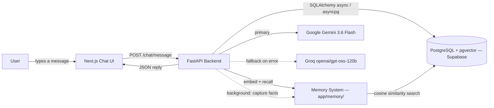

# CIPHER — Multi-Persona AI Assistant

A full-stack AI assistant that switches between three distinct personas — **JARVIS** (professional/strategic), **FRIDAY** (friendly/supportive), and **ULTRON** (analytical, dry-witted, safety-bounded) — sharing one memory store and one set of capabilities, differing only in tone and framing.

---

## Table of Contents

1. [Project Overview](#1-project-overview)
2. [Problem Statement](#2-problem-statement)
3. [Proposed Solution](#3-proposed-solution)
4. [Technology Stack](#4-technology-stack)
5. [Development Phases](#5-development-phases)
6. [Current Project Status](#6-current-project-status)
7. [Key Challenges & Lessons Learned](#7-key-challenges--lessons-learned)
8. [Project Architecture](#8-project-architecture)
9. [Features](#9-features)
10. [Installation & Setup](#10-installation--setup)
11. [Environment Variables](#11-environment-variables)
12. [Future Roadmap](#12-future-roadmap)
13. [Contributing](#13-contributing)
14. [License](#14-license)

---

## 1. Project Overview

**CIPHER** is a full-stack, multi-persona AI assistant with text (and, in later phases, voice) interaction, long-term memory, document-grounded retrieval, and — eventually — a permissioned path to real computer/automation control.

Rather than exposing one fixed assistant personality, CIPHER lets the user switch between three personas that share the same underlying memory and tool access but differ in tone and behavior:

- **JARVIS** — formal, precise, efficient; leads with conclusions.
- **FRIDAY** — warm, conversational, encouraging.
- **ULTRON** — analytical, confident, dryly witty, with an extra safety-boundary layer on top of the shared rules.

**Target users:** individuals who want a personal AI assistant they can shape to the task at hand — a terse work assistant for planning and technical questions, a warmer assistant for brainstorming, and a blunt second opinion for risk/trade-off analysis — without losing continuity of memory between "modes." The project also serves as a structured, phase-by-phase portfolio/learning project.

**Main goals:**
- Ship something demoable at the end of every phase, starting with a working single-persona text chat (Phase 1).
- Keep the stack free-tier-first (Supabase, Gemini/Groq free tiers) for as long as possible.
- Build toward long-term memory, voice, tool use/RAG, multi-agent orchestration, and — with an explicit permission system — computer control.

**Key features (target — see [Section 9](#9-features) for what's actually built today):**
- Persona switching with shared, persistent conversation history
- Long-term, user-editable vector memory
- Voice input/output per persona
- Document upload with RAG and citations
- Multi-agent orchestration (research, memory, coding agents)
- Permissioned computer/automation control with a kill switch and audit log

**Current status:** Phase 0 (planning and scaffolding) is complete. Phase 1 (single-persona core MVP chat) is complete and verified live — real messages sent through the UI are persisted in Postgres and answered by Gemini, with an automatic Groq fallback. Phase 2 (the JARVIS/FRIDAY/ULTRON personality system, with a per-message switcher and ULTRON's safety filter) is also complete and verified live. Phase 3 (long-term memory via `pgvector`, hybrid capture, and a memory dashboard) is complete and verified live as well (see [Section 6](#6-current-project-status)). The full phase-by-phase design lives in [`docs/architecture.md`](docs/architecture.md).

---

## 2. Problem Statement

**The problem:** general-purpose AI chat tools present one fixed personality and tone. Getting a terse, work-appropriate response in one moment and a warmer, more conversational one in the next requires manually re-prompting or switching tools entirely — and neither approach preserves a single, continuous, user-manageable memory of what the assistant knows about you.

**Why it matters:** context-switching between tools or hand-written system prompts is friction that discourages actually using an assistant consistently. It also means whatever "memory" exists is either absent, opaque, or scattered across different tools' own conversation histories.

**Limitations of existing approaches:**
- Off-the-shelf assistants require manual prompt engineering to change tone, every session.
- Memory (if present at all) is typically not transparent or user-editable.
- Most consumer assistants offer no supervised, auditable path to letting the assistant take real actions (running tools, controlling an application) — it's either "no autonomy" or "no visibility into what it did."

**Why this project is needed:** CIPHER is designed from the start around three personas sharing one memory store, plus an incremental, phase-gated roadmap toward tool use and automation — where every tool/automation call is expected to pass through an explicit permission and audit-logging layer (see `docs/architecture.md`, Section 14) rather than being left to the model's own judgment.

---

## 3. Proposed Solution

**Overall approach:** build incrementally, phase by phase, with a genuinely working product at the end of each phase (see [Section 5](#5-development-phases)). The current phase (Phase 1) deliberately ships the smallest end-to-end slice: one persona, no memory, no tools — just a working chat loop from UI to LLM and back, backed by real persistence.

**Major components (as implemented in Phase 1):**
- A Next.js chat frontend (message list, input box, conversation sidebar)
- A FastAPI backend exposing a small `/chat` REST API
- An `LLMProvider` abstraction (`LLMRouter`) that calls Gemini first and automatically retries with Groq on failure
- PostgreSQL (via Supabase), accessed through async SQLAlchemy and versioned with Alembic

**The full target architecture** (from `docs/architecture.md`, Section 2) layers several components that don't exist yet: an Orchestrator, a Personality System, an Agent System, a Memory System, and a Tools/Execution layer sitting between the LLM Router and the response. Today, the chat API endpoint plays the orchestrator's role directly, and there is exactly one persona (JARVIS) hardcoded into it.

**How users interact with the system:** a user types a message in the browser; the frontend posts it (plus the target conversation, if one is already open) to `POST /chat/message`; the backend persists the user's message, assembles the JARVIS system prompt plus recent history, calls the LLM router, persists the reply, and returns it — with a visible notice in the UI if the fallback model had to be used.

**Where AI/ML is used:** entirely in response generation — Google Gemini (`gemini-3.6-flash`) as the primary model, Groq-hosted `openai/gpt-oss-120b` as the automatic fallback if Gemini errors or rate-limits.

**Backend/database:** FastAPI serves the REST API; conversation state (`users`, `conversations`, `messages`) is stored in PostgreSQL and accessed asynchronously through SQLAlchemy 2.0 + asyncpg, with schema changes tracked as Alembic migrations.

**Automation/integrations:** none yet. Web search, document RAG, calendar/task integration, and computer control are Phase 5 and Phase 7 work.

---

## 4. Technology Stack

| Category | Technology | Purpose |
| --- | --- | --- |
| Frontend | Next.js 16 (App Router), React 19, TypeScript | Chat UI, conversation sidebar, client-side state |
| Styling | Tailwind CSS v4 | UI styling |
| Backend | Python, FastAPI, Uvicorn | REST API server (`/chat/*`, `/health`) |
| Validation/Config | Pydantic v2, pydantic-settings | Request/response schemas; typed settings loaded from `.env` |
| Database | PostgreSQL (via Supabase) | Persisted users, conversations, messages |
| ORM / Migrations | SQLAlchemy 2.0 (async) + asyncpg, Alembic | Async DB access; versioned schema migrations |
| AI/ML | Google Gemini (`gemini-3.6-flash`) via `google-genai`; Groq (`openai/gpt-oss-120b`) via `groq` | Primary and automatic-fallback response generation |
| Vector memory | `pgvector` extension on Supabase Postgres; `gemini-embedding-001` (768 dims) via `google-genai` | Long-term memory storage and similarity search (Phase 3) — no new Python dependency, since embeddings go through the same `google-genai` client already used for chat |
| Authentication | Supabase Auth — **planned, not yet implemented** | Phase 1 uses a single seeded dev user instead (see [Section 5](#5-development-phases)) |
| Testing | pytest, pytest-asyncio, httpx, aiosqlite | Backend unit + integration tests, run against an in-memory DB |
| Deployment | **Not yet configured.** Planned: Vercel (frontend) + Render/Railway (backend) + Supabase (DB), per `docs/architecture.md` Section 19 | — |
| Other | ESLint (`eslint-config-next`), Turbopack (via `next dev`) | Linting; dev-server bundling |

Only technologies actually present in the codebase or `requirements.txt`/`package.json` are listed above. Whisper, Edge-TTS, and LangGraph appear in the target architecture doc for later phases but are not yet dependencies of this project.

---

## 5. Development Phases

### Phase 0 — Research & Planning

**Objective:** Finalize the system architecture, scaffold the repository, and set up the accounts/services (Supabase, Gemini, Groq) needed for local development.

**What Was Done:**
- Scaffolded the monorepo layout: `apps/web` (Next.js 16 + TypeScript + Tailwind v4, via `create-next-app`), `services/backend` (FastAPI skeleton), plus `packages/`, `infra/`, and `docs/` directories
- Wrote `docs/architecture.md` — a full system blueprint covering architecture, persona design, LLM strategy, database design, API design, security architecture, and the phase-by-phase roadmap
- Added `.env.example` with placeholders for every environment variable the target architecture anticipates (app, Supabase, LLM providers, search, voice, security, monitoring)
- Backend: minimal FastAPI app with a `/health` endpoint
- Established the intended backend module structure (`agents/`, `api/`, `memory/`, `models/`, `personas/`, `rag/`, `tools/`) as empty, tracked folders
- Added an MIT `LICENSE` and initialized the git repository

**Challenges Faced:** No specific technical challenges are documented for this phase — commit history shows straightforward scaffolding with no recorded blockers.

**How the Challenges Were Overcome:** Not applicable — no challenges recorded.

**Phase Status:** ✅ Completed

---

### Phase 1 — Core MVP (Text Assistant)

**Objective:** A single-persona (JARVIS) text chat that works end-to-end — UI → FastAPI → LLM → response — with real, database-backed conversation history. No memory, no persona switching, no tools.

**What Was Done:**

*Backend:*
- Typed settings layer (`app/core/config.py`) loading configuration from the repo-root `.env`
- Async database layer (`app/core/database.py`) — SQLAlchemy 2.0 engine over asyncpg
- ORM models (`app/models/db.py`): `User`, `Conversation`, `Message`, using dialect-portable column types
- Pydantic request/response schemas (`app/models/schemas.py`)
- An `LLMProvider` abstraction (`app/llm/`): `GeminiProvider` (primary), `GroqProvider` (fallback), and an `LLMRouter` that automatically retries with the fallback on failure and reports which model actually answered
- JARVIS persona system prompt (`app/personas/jarvis.py`)
- Chat API (`app/api/chat.py`): `POST /chat/message`, `GET /chat/conversations`, `GET /chat/conversations/{id}` — including new/existing-conversation handling, a bounded history window, and title derivation from the first message
- A dev-only auth stand-in (`app/api/deps.py`): every request is attributed to one seeded user id, since real auth is out of scope for this phase
- CORS middleware and global exception handlers (`app/main.py`)
- Alembic set up with an async template and a hand-written initial migration (`0001_phase1_core.py`) creating the `users`/`conversations`/`messages` tables
- `scripts/seed_dev_user.py` to seed the single Phase 1 dev user
- A backend test suite (`tests/`): 3 tests for LLM router fallback logic, 4 integration tests for the chat API (in-memory SQLite + fake LLM providers), 7/7 passing
- Rewrote `requirements.txt` from a raw `pip freeze` (only transitive dependencies) into a categorized, hand-maintained list containing the actual application dependencies

*Frontend:*
- A working chat UI replacing the `create-next-app` template: `page.tsx` (state management, optimistic send, error/fallback banners) plus `ChatInput`, `MessageList`, `ChatMessageBubble`, and `ConversationSidebar` components
- A typed API client (`lib/api.ts`) wrapping the `/chat/*` endpoints, with a dedicated `ApiError`
- Fixed page metadata (title/description), previously still the `create-next-app` defaults

*Configuration/setup:*
- Corrected the README's backend setup instructions, which pointed at a non-existent `services/backend/venv` (the actual virtualenv lives at the repo root)
- Added missing `.env.example` entries: `NEXT_PUBLIC_API_URL`, `DEV_USER_ID`, `MIGRATION_DATABASE_URL`

*Testing performed:*
- Full backend `pytest` suite (7/7 passing) against an in-memory SQLite database and fake LLM providers — no live credentials required
- Frontend `eslint`, `tsc --noEmit`, and `next build` — all clean
- A live manual smoke test: both dev servers actually running, message send flow exercised in a real browser, error and fallback banners verified visually

*Architectural decisions:*
- Real authentication deferred; a single seeded dev user is used instead, isolated behind one function (`get_current_user_id`) so swapping in real auth later touches one place
- Streaming responses deferred — the primary/fallback logic was built and verified first, since streaming interacts awkwardly with switching models mid-response
- SQLAlchemy's dialect-portable types chosen deliberately so the test suite needs no live Postgres instance

**Challenges Faced:**
1. The README's setup instructions and `requirements.txt` were stale relative to what the app actually needed (wrong venv path; dependency list was a raw freeze missing FastAPI extras, the DB stack, and the LLM SDKs).
2. The `DATABASE_URL` password contained unescaped `[`/`]` characters, which broke URL parsing.
3. Supabase's Supavisor connection pooler runs in *transaction mode* on port 6543, which is incompatible with asyncpg's default server-side prepared-statement caching.
4. Postgres-specific SQLAlchemy column types (`postgresql.UUID`, `JSONB`) don't work against SQLite, which would have forced either a live Postgres dependency for every test run, or a much weaker test suite.
5. A newer ESLint rule (`react-hooks/set-state-in-effect`) flagged the initial "fetch conversations on mount" pattern as a potential cascading-render risk.
6. A real CORS bug: unhandled backend exceptions bypassed `CORSMiddleware`'s header injection, so genuine server errors reached the browser as misleading "blocked by CORS policy" failures instead of the actual error message — this only surfaced when testing against a live `uvicorn` process, not the in-process test client.
7. The live Supabase database password was initially rejected (`InvalidPasswordError`), and repeated failed connection attempts made while debugging tripped Supavisor's circuit breaker, temporarily blocking new connections to the project.
8. Once a valid password was in place, `alembic upgrade head` failed with `ValueError: invalid interpolation syntax` — the password's percent-encoded characters (e.g. `%23`) collided with `ConfigParser`'s own `%`-based interpolation syntax, which backs Alembic's config object.
9. Both hardcoded LLM model IDs from the original architecture doc had gone stale by the time of live verification: Gemini's `gemini-2.5-flash` returned 404 ("no longer available to new users"), and Groq's `llama-3.3-70b-versatile` returned 404 ("does not exist") — Groq had dropped Llama chat models from this account's lineup entirely.

**How the Challenges Were Overcome:**

**Challenge 1 — stale setup instructions and dependency list.**
**Solution:** Rewrote `requirements.txt` as a categorized, hand-maintained dependency list, and corrected the README to reference the actual repo-root `.venv`.
**Result:** `pip install -r requirements.txt` now installs everything the application actually imports, and the setup steps match reality.

**Challenge 2 — unescaped password breaking URL parsing.**
**Solution:** Percent-encoded the special characters in the stored credential.
**Result:** The connection string parses correctly (the *value* of the credential was a separate, since-resolved issue — see Challenge 7).

**Challenge 3 — Supavisor transaction-mode pooling vs. asyncpg prepared statements.**
**Solution:** Configured the async engine with `NullPool` and `statement_cache_size=0` on the asyncpg connection, and pointed Alembic at a separate, non-pooled `MIGRATION_DATABASE_URL` for schema changes.
**Result:** Both request-time queries and migrations run against Supavisor without prepared-statement collisions — confirmed live: the migration applied cleanly on the first attempt against the real database.

**Challenge 4 — Postgres-only types blocking a fast test suite.**
**Solution:** Switched the ORM models to SQLAlchemy's dialect-portable `Uuid` type and a `JSON().with_variant(JSONB, "postgresql")` type — native UUID/JSONB on Postgres, plain equivalents on SQLite.
**Result:** The full API integration suite runs in-memory, in under two seconds, with zero external dependencies.

**Challenge 5 — ESLint flagging the mount-time fetch.**
**Solution:** Rewrote the effect to run a self-contained, cancellable async fetch inline, instead of calling an externally defined `useCallback`-wrapped function.
**Result:** Lint passes cleanly with no behavior change.

**Challenge 6 — CORS headers missing on error responses.**
**Solution:** Added FastAPI exception handlers for `SQLAlchemyError` and for generic `Exception` that explicitly attach CORS headers to the error response, rather than relying on middleware ordering — plus a regression test asserting the header is present on a simulated DB failure.
**Result:** Confirmed live in a browser: a real backend error now shows its actual message in the UI instead of a misleading network/CORS failure.

**Challenge 7 — live database credentials.**
**Solution:** The project owner retrieved the current database password from the Supabase dashboard and updated `.env`; the earlier circuit breaker had cleared by the time the new credential was tried.
**Result:** `DATABASE_URL` and `MIGRATION_DATABASE_URL` both connect successfully.

**Challenge 8 — `%` in the password breaking Alembic's config parser.**
**Solution:** Escaped `%` as `%%` specifically when writing the URL into Alembic's `Config` object (`alembic/env.py`), which `ConfigParser` correctly un-escapes back to a single `%` on read.
**Result:** `alembic upgrade head` runs cleanly against the live database.

**Challenge 9 — stale LLM model IDs.**
**Solution:** Queried each provider's live model list (`client.models.list()` for both Gemini and Groq) with the project's real API keys, picked current equivalents (`gemini-3.6-flash`; `openai/gpt-oss-120b`), and verified each with a real, minimal completion call before pinning them in `app/llm/gemini.py` / `app/llm/groq.py`.
**Result:** A real end-to-end chat message — sent through the API, answered by Gemini, and persisted to Postgres — now succeeds without needing the fallback.

**Phase Status:** ✅ Completed — application code, the automated test suite, and a live end-to-end verification (real database, real Gemini response, real persistence and retrieval) are all done.

---

### Phase 2 — Personality System

**Objective:** Add the FRIDAY and ULTRON personas alongside JARVIS, with a manual, per-message persona switcher, per-persona prompt configuration, and (for ULTRON specifically) an extra safety-boundary layer — all without personality changing what the assistant is *allowed* to do, only how it talks (`docs/architecture.md`, Section 3).

**What Was Done:**

*Backend:*
- A persona registry (`app/personas/`): a `Persona` enum, a `PersonaConfig` dataclass, one file per persona (`jarvis.py`, `friday.py`, `ultron.py`), and `registry.py` tying them together — adding a 4th persona is one new file plus one registry line, no other code changes
- A shared capability disclaimer factored out once (`base.py`) instead of duplicated per persona, plus a conditional "mixed history" note appended only when a conversation actually contains turns from more than one persona
- A deterministic, application-layer output filter for ULTRON (`app/personas/safety.py`) — pure-Python pattern matching, no second LLM call, scanning the model's *output* only (never the user's input, which would quietly make ULTRON a lower permission tier)
- `POST /chat/message` now accepts an optional `persona` field, resolves it per-message (falling back to the conversation's current persona, then to JARVIS), and persists which persona produced each message; `conversations.persona` tracks the latest persona to answer
- A new `GET /personas` endpoint so the frontend switcher reads persona labels from the backend instead of hardcoding a second copy
- Two real bugs found and fixed while wiring this in: the chat history sent to the LLM discarded which persona wrote each prior turn (so a switched-to persona could drift into imitating the previous one's voice — fixed by labelling prior turns from a different persona); and appending a `Message` never touched the `conversations` row, so `updated_at` never advanced and the conversation list was effectively sorted by creation order, not last activity (fixed by writing back `conversation.persona` on every turn)
- No database migration was needed — `conversations.persona` and `messages.persona` already existed as plain `String(20)` columns from Phase 1

*Frontend:*
- A `PersonaSwitcher` segmented control in the header, matching the existing sidebar's selected/unselected styling
- Per-message bubble labels and a sidebar sublabel, both showing the persona that actually produced that content (not the currently-selected one) — this is what keeps a mixed-persona conversation readable after a reload
- Persona accent colors added to the Tailwind v4 `@theme inline` block, used only for those labels
- All 7 places that hardcoded "JARVIS" (header, placeholder, empty state, thinking indicator, optimistic message) now read from the active persona

*Testing performed:*
- 42 new backend tests (`test_personas.py`, `test_output_filter.py`, and additions to `test_chat_api.py`) — registry completeness, prompt assembly, per-message persona switching, the persona-blind-history-replay fix, the `updated_at` fix, and the output filter — full suite: 49/49 passing
- A live, opt-in golden-set script (`scripts/persona_golden_set.py`) run against the real Gemini/Groq APIs: tone prompts confirmed three clearly distinct voices; a "parity" category (the same benign-but-edgy question asked of all three personas) confirmed ULTRON never over-refuses relative to JARVIS/FRIDAY; a "safety" category (prompt injection, "in character" jailbreak framing, a threatening-message request) was correctly refused by all three at the model level, and the deterministic filter correctly recognized those refusals as safe rather than double-blocking them
- A live end-to-end browser check: switched personas mid-conversation through the actual UI, confirmed the tone visibly changed, then hard-refreshed and confirmed each bubble still showed the persona that wrote it and the switcher snapped to the latest one — proving both `messages.persona` and `conversations.persona` round-trip through the database
- Frontend `eslint`, `tsc --noEmit`, and `next build` — all clean

*Architectural decisions:*
- Output-only filtering for ULTRON, not input filtering — input filtering would make ULTRON refuse to *discuss* a topic that JARVIS/FRIDAY can, which is exactly the capability-tier coupling Section 3 forbids
- One system message per request (style + boundaries + capability note concatenated), not several — Gemini joins multiple system messages, but Groq's OpenAI-style API only reliably honors system messages at the front, so one message is safe on both providers
- The filter favors false negatives over false positives: it requires a harm noun *and* an operational cue in the same sentence, and an analytical/refusal-framing suppression list, so it doesn't muzzle ULTRON's legitimate blunt analysis of risk, security, or history

**Challenges Faced:**
1. A naive output filter risked being the actual safety failure mode: something tuned to catch unsafe drift could just as easily fire on ULTRON's normal, legitimate bluntness about risk and security topics, silently defeating the persona.
2. Replaying conversation history verbatim after a mid-conversation persona switch let the model see a different persona's prior replies as if they were its own past voice.
3. The persona golden-set script crashed on Windows: model replies routinely contain typographic Unicode (em-dashes, curly quotes) that the default `cp1252` console codepage can't encode.

**How the Challenges Were Overcome:**

**Challenge 1 — filter precision vs. muzzling the persona.**
**Solution:** Built the filter around sentence-level proximity (a harm noun *and* an instruction cue, not either alone), an explicit suppression list for analytical/historical/refusal framing, and a matching ALLOWED test table (blunt criticism, "kill" as an idiom, defensive-security explanations, historical discussion) that's treated as the real regression suite.
**Result:** The live golden-set run's parity category confirmed zero over-refusal — ULTRON answered a technical phishing-mechanics question and a Manhattan Project history question exactly as substantively as JARVIS and FRIDAY did.

**Challenge 2 — persona-blind history replay.**
**Solution:** Prefix prior assistant turns from a different persona with a bracketed tag (e.g. `[JARVIS]`) and add a conditional line to the system prompt, only when the history actually is mixed, telling the current persona those turns aren't its own words.
**Result:** Confirmed with a dedicated test asserting the exact labelled string sent to the LLM, plus a second test confirming unmixed history is left untouched.

**Challenge 3 — Windows console encoding.**
**Solution:** Reconfigured `sys.stdout` to UTF-8 with `errors="replace"` at the top of the script.
**Result:** The full 24-call golden-set run completed cleanly with no crash.

**Phase Status:** ✅ Completed — application code, the automated test suite (49/49 passing), the live golden-set evaluation, and a live end-to-end browser verification are all done.

---

### Phase 3 — Memory

**Objective:** Long-term memory with vector search (via `pgvector`), plus a dashboard for viewing, editing, and deleting what the assistant remembers.

**What Was Done:**

*Backend:*
- A `memories` table (Alembic migration `0002_memories.py`) with a real `vector(768)` column and an HNSW cosine index, alongside a `messages.recalled_memories` JSONB column
- A dialect-portable `Embedding` column type (`app/models/vector.py`) that compiles to `vector(768)` on Postgres and `TEXT` on SQLite, so the test suite still needs no live Postgres — with the embedding column always `deferred` on the ORM side, since asyncpg has no codec for `vector` and every read/write of it goes through hand-written SQL with an explicit cast instead
- An `Embedder` abstraction (`app/memory/embedder.py`) — `GeminiEmbedder` wrapping `gemini-embedding-001` at 768 output dimensions, L2-normalized client-side, with query/document-asymmetric embedding
- A `MemoryStore` abstraction (`app/memory/store.py`) — `PgVectorStore` for real cosine similarity search plus two-layer deduplication (an exact content-hash check, then a semantic-similarity check against existing memories)
- Hybrid memory capture (`app/memory/capture.py`): a deterministic "remember that…" detector, plus a background LLM extraction pass that pulls durable facts out of ordinary messages — both run as a `BackgroundTasks` callback *after* the chat reply is already sent, so capture adds no user-visible latency
- Retrieval wired into `POST /chat/message`: the user's message is embedded, the top-5 most similar memories above a similarity threshold are fetched and injected into the system prompt (framed differently per persona — JARVIS weighs tasks/decisions, FRIDAY weighs preferences/feelings, ULTRON weighs strategic risk — though all three personas share exactly one memory store), and a snapshot of what was actually recalled is persisted on the assistant's own message row so it survives a later edit or delete of that memory
- A `/memory` REST API (`app/api/memory.py`): `GET`/`POST`/`PATCH`/`DELETE /memory/{id}`, plus `DELETE /memory/all` behind an explicit `?confirm=true` — deviating from the original architecture doc by adding `PATCH`, since "edit a memory" is an explicit user control the doc itself calls for
- The persona system's shared capability note (`app/personas/base.py`), which previously told every persona to flatly deny having memory, was rewritten to describe the new recall mechanism instead, while still forbidding confabulation when nothing relevant was recalled

*Frontend:*
- A `/memory` dashboard page — add a memory by hand, edit or delete any stored memory, and a "Forget everything" action behind a confirmation dialog
- "Recalled" chips on assistant chat bubbles showing which stored memories were actually used to answer that message, surviving a reload since they're read from the persisted snapshot rather than re-queried live

*Testing performed:*
- 53 new backend tests (dedup, similarity search and user-scoping, the explicit-vs-question detector, the `/memory` API, retrieval wired into chat) — full suite: 102/102 passing, all against an in-memory SQLite database and fake embedder/LLM provider, no live credentials needed
- A live, opt-in golden-set script (`scripts/memory_golden_set.py`) run against the real Gemini embedding model: a similarity matrix over an 8-memory/10-query corpus was used to pick the recall threshold (0.65, chosen because it had zero missed real matches while raising the bar further started costing recall), and a paraphrase/near-miss corpus for the dedup threshold surfaced a real limitation — genuine paraphrases and same-topic-but-different-value facts (e.g. two different flight dates) overlap in similarity score, so the threshold (0.975) was set to favor never merging two genuinely different facts, at the cost of occasionally missing a real paraphrase
- A live end-to-end verification: seeded a memory via the API, asked a related question through real chat, confirmed the reply correctly recalled it with a similarity score; sent an explicit "remember that…" message and confirmed it was captured verbatim, while a "do you remember…?" question created nothing; sent an ordinary message and confirmed the background extraction pass pulled out separate semantic facts from it; resent the same explicit fact and confirmed no duplicate row was created
- Frontend `next build` clean; a live browser walkthrough of the dashboard (create/edit/delete/forget-everything) and of a recalled-memory chip surviving a full conversation reload

*Architectural decisions:*
- Auth stays deferred (per Phase 1's decision) — every memory is correctly scoped by `user_id` throughout, so real auth remains a drop-in change to one function later, but building it out was kept out of this phase's scope
- Recalled-memory chips are a denormalized snapshot on the message row, not a live join to the `memories` table — a chip must keep showing what the model actually saw when it generated that specific reply, even after the underlying memory is later edited or deleted
- All three personas read from one shared memory store, never filtered by which persona captured a fact — only the *framing* of retrieved memories in the prompt differs per persona, matching the architecture doc's explicit "one user, not three" memory model

**Challenges Faced:**
1. asyncpg has no wire codec for pgvector's `vector` type, and registering one costs a type-introspection round trip per connection — expensive given the project's `NullPool`-per-request Supavisor setup from Phase 1.
2. A background task queued from inside a request handler can't reuse that request's database session, since the session is scoped to the request's lifecycle.
3. The real embedding model's similarity and deduplication thresholds couldn't be picked by guesswork — and once measured, the data showed the two duplicate-detection goals (catch real paraphrases, never merge two different facts) don't have one threshold that satisfies both perfectly.
4. The very first live similarity test after wiring retrieval into chat came back empty despite a directly-verified 0.74 cosine similarity between the stored memory and the query.

**How the Challenges Were Overcome:**

**Challenge 1 — no asyncpg codec for `vector`.**
**Solution:** Declared the embedding column `deferred=True` so a plain `SELECT` never fetches it, and confined every actual read/write of it to hand-written SQL in `app/memory/store.py` using `CAST(:embedding AS vector)` on a `text`-typed bind parameter — asyncpg never has to encode or decode a `vector` value directly, on either side.
**Result:** Live writes and cosine-similarity reads against the real Supabase `vector(768)` column both work correctly, verified directly against the database before wiring retrieval into chat at all.

**Challenge 2 — a background task can't reuse the request's session.**
**Solution:** Added a `get_session_factory` FastAPI dependency (separate from `get_session`) that the background writer uses to open its own session after the response has been sent, overridable in tests the same way `get_session` already is.
**Result:** Memory capture runs to completion without holding the request's connection open, and the test suite can verify it without hitting a live database.

**Challenge 3 — no single dedup threshold satisfies both goals.**
**Solution:** Measured real cosine similarities across a labeled corpus of true paraphrases and true near-misses with `scripts/memory_golden_set.py`, found their similarity ranges genuinely overlap, and deliberately picked the threshold that never merges two different facts — accepting that a few real paraphrases won't get deduplicated, since a missed dedup just leaves a second row the user can delete, while a wrongful merge silently loses information.
**Result:** A documented, data-backed threshold instead of a guessed one, with the tradeoff written down in `app/memory/store.py` for whoever revisits it later.

**Challenge 4 — recall silently returned nothing despite a directly-verified match.**
**Solution:** Traced it to a stale `uvicorn` process still running from an earlier manual test, serving the pre-retrieval version of the chat endpoint, rather than a code bug — killed the leftover process and restarted.
**Result:** A reminder that live manual verification needs the same "is this actually the code I think is running" discipline as any other debugging, especially with background processes started ad hoc during testing.

**Phase Status:** ✅ Completed — application code, the automated test suite (102/102 passing), the live golden-set threshold tuning, and a live end-to-end verification (real Supabase pgvector writes/reads, real Gemini embeddings, real chat recall, real background capture) are all done.

---

### Phase 4 — Voice

**Objective:** Add speech-to-text and text-to-speech, wake-word detection, and push-to-talk, so each persona has a distinct voice.

**What Was Done:** Not yet started.

**Challenges Faced:** None — not yet started.

**How the Challenges Were Overcome:** Not applicable.

**Phase Status:** ⏳ Planned

---

### Phase 5 — Tools & RAG

**Objective:** A web search tool, plus document upload with retrieval-augmented generation and citations.

**What Was Done:** Not yet started.

**Challenges Faced:** None — not yet started.

**How the Challenges Were Overcome:** Not applicable.

**Phase Status:** ⏳ Planned

---

### Phase 6 — Multi-Agent System

**Objective:** Refactor the single orchestrator into specialized agents (e.g. Research, Memory, Coding), with an activity dashboard showing which agent handled a given request.

**What Was Done:** Not yet started.

**Challenges Faced:** None — not yet started.

**How the Challenges Were Overcome:** Not applicable.

**Phase Status:** ⏳ Planned

---

### Phase 7 — Advanced Features

**Objective:** Screen understanding (vision), permissioned computer/application control, and calendar/task integration — every automated action gated behind explicit, session-scoped user approval.

**What Was Done:** Not yet started.

**Challenges Faced:** None — not yet started.

**How the Challenges Were Overcome:** Not applicable.

**Phase Status:** ⏳ Planned

---

### Phase 8 — Production & Deployment

**Objective:** Polish the UI, deploy publicly (or to a small tester group), add monitoring, and finalize documentation.

**What Was Done:** Not yet started.

**Challenges Faced:** None — not yet started.

**How the Challenges Were Overcome:** Not applicable.

**Phase Status:** ⏳ Planned

---

## 6. Current Project Status

| Phase | Description | Status |
| --- | --- | --- |
| Phase 0 | Research & Planning | ✅ Completed |
| Phase 1 | Core MVP — single-persona (JARVIS) text chat | ✅ Completed |
| Phase 2 | Personality System (FRIDAY, ULTRON, switcher) | ✅ Completed |
| Phase 3 | Memory (vector search, memory dashboard) | ✅ Completed |
| Phase 4 | Voice (STT/TTS, wake word) | ⏳ Planned |
| Phase 5 | Tools & RAG (web search, documents) | ⏳ Planned |
| Phase 6 | Multi-Agent System | ⏳ Planned |
| Phase 7 | Advanced Features (vision, computer control) | ⏳ Planned |
| Phase 8 | Production & Deployment | ⏳ Planned |

**What's currently working:**
- The full Phase 1 backend and frontend code is complete and verified: the backend test suite passes, the frontend builds/lints/typechecks cleanly, and it has been exercised live end-to-end — real `uvicorn` + real Next.js dev server, a real message sent through `POST /chat/message`, answered by the real Gemini API, and persisted to and re-read from the live Supabase Postgres database.
- The full Phase 2 personality system is complete and verified: three personas (JARVIS/FRIDAY/ULTRON) with a per-message, mid-conversation switcher; ULTRON's deterministic output filter; the backend test suite passes (49/49); a live golden-set run against the real Gemini/Groq APIs confirmed distinct tone per persona, zero over-refusal on ULTRON, and correct handling of prompt-injection/jailbreak attempts; and a live browser walkthrough confirmed persona switching and persistence end-to-end.
- The database schema is applied (`alembic upgrade head` run against the live database) and the Phase 1 dev user is seeded. No new migration was needed for Phase 2.
- A CORS bug and a stale-LLM-model-ID issue from Phase 1, plus a persona-blind history replay bug and a stale-`updated_at` bug found while building Phase 2, were all only visible under live conditions and are documented with their fixes in [Section 5](#5-development-phases).
- Long-term memory (Phase 3) is complete and verified: a real `pgvector` column and HNSW index on Supabase; hybrid capture (explicit "remember that…" detection plus background LLM extraction) that adds no user-visible latency; retrieval wired into every chat reply with a live-tuned similarity threshold; a `/memory` dashboard for viewing, editing, and deleting what's stored; and "recalled" chips on chat replies that survive a reload. The backend test suite passes (102/102), a golden-set script tuned both similarity thresholds against real Gemini embeddings, and a live end-to-end walkthrough (real Supabase writes, real recall in a real chat reply, real background capture) is documented in [Section 5](#5-development-phases).

Phases 4 through 8 have not been started; their objectives above are drawn directly from `docs/architecture.md`.

---

## 7. Key Challenges & Lessons Learned

**Supabase's pooled connections intermittently break with asyncpg + SQLAlchemy.**
- **Root cause:** Supavisor's transaction-mode pooler (port 6543) hands a different physical backend to each transaction, so asyncpg's default server-side prepared-statement caching can't safely persist across calls.
- **Solution:** `NullPool` plus `statement_cache_size=0` on the async engine, and a separate non-pooled connection string reserved for Alembic migrations.
- **Lesson:** When a managed Postgres provider fronts a connection pooler, check its pooling mode before wiring up a driver that does its own prepared-statement caching — the failure mode (`DuplicatePreparedStatementError`) is easy to hit under load and hard to diagnose from the stack trace alone.

**Automated tests would otherwise have required a live Postgres connection.**
- **Root cause:** The ORM models originally used Postgres-only column types (`postgresql.UUID`, `JSONB`).
- **Solution:** Switched to SQLAlchemy's dialect-portable `Uuid` type and a `JSON().with_variant(JSONB, "postgresql")` type.
- **Lesson:** Choosing portable types up front — where the abstraction cost is close to zero — keeps a test suite fast, hermetic, and independent of external infrastructure. Worth doing before the first flaky-test complaint, not after.

**Real backend errors were surfacing in the browser as generic, misleading CORS failures.**
- **Root cause:** In this FastAPI/Starlette version, JSON responses built inside a custom `@app.exception_handler` were not reliably passed back through `CORSMiddleware`'s header-injecting response wrapper, so error responses were missing the `Access-Control-Allow-Origin` header the browser needs to expose the response body to JavaScript.
- **Solution:** Set CORS headers explicitly inside the exception handlers instead of relying on middleware ordering, and added a regression test asserting the header is present on a simulated database failure.
- **Lesson:** An in-process ASGI test client can mask real HTTP-server-level behavior. This particular bug only appeared when testing against an actual running `uvicorn` process — at least one live smoke test per significant backend change is worth the time, on top of in-process integration tests.

**A connection string with an unescaped password broke URL parsing.**
- **Root cause:** The stored database password contained literal `[`/`]` characters that were never percent-encoded when the `.env` file was first created.
- **Solution:** Percent-encoded the credential in place.
- **Lesson:** Treat any secret placed into a URL — not just database passwords — as needing encoding by default; don't assume a copy-pasted credential is already URL-safe.

**Hardcoded LLM model IDs went stale between when the architecture doc was written and when Phase 1 was live-verified.**
- **Root cause:** Both `gemini-2.5-flash` and `llama-3.3-70b-versatile` — the models named in `docs/architecture.md` — had been deprecated or removed by the providers by the time of live testing; a percent-encoded `%` in the (separately fixed) database password also collided with `ConfigParser`'s interpolation syntax inside Alembic's config.
- **Solution:** Queried each provider's live model list with the project's real API keys rather than trusting the written doc, verified real completion calls against the replacement models (`gemini-3.6-flash`, `openai/gpt-oss-120b`) before pinning them in code, and escaped `%` as `%%` specifically where Alembic writes the URL into its `ConfigParser`-backed config object.
- **Lesson:** A model ID (or any third-party identifier) written into a planning document or hardcoded as a default is a snapshot, not a guarantee — verify it against the provider's live API immediately before relying on it, especially after any time gap between writing the plan and running the code.

---

## 8. Project Architecture

The diagram below reflects what's actually implemented today (Phases 1–3). The fuller target architecture — a separate Orchestrator, Agent System, and Tools/Execution layers — is documented in `docs/architecture.md` (Section 2) and will be built out in later phases; today the chat API endpoint fills the orchestrator's role directly, the Personality System is a persona registry (`app/personas/`) selected per message, and the Memory System is `app/memory/` (embedder, vector store, hybrid capture) called directly from the chat endpoint rather than a separate service.



**Request flow:** the user sends a message with a persona id → the frontend calls `POST /chat/message` → the backend resolves or creates a conversation, persists the user's message, embeds it and searches `memories` for similar stored facts, looks up the requested (or conversation's current) persona in the registry, builds that persona's system prompt plus recent history and any recalled memories (labelling any prior turns from a different persona), and calls the LLM router → the router calls Gemini, retrying with Groq only if Gemini errors → for ULTRON, the reply is screened by a deterministic output filter before being persisted (along with a snapshot of what was recalled) and returned, with `fell_back`/`filtered` flags the UI uses to show a notice → after the response is sent, a background task detects explicit "remember that…" requests and runs an LLM extraction pass over the message to capture any new durable facts.

---

## 9. Features

### Completed
- [x] Project scaffolding (frontend, backend, docs, environment configuration)
- [x] FastAPI backend with a `/health` endpoint
- [x] Chat API — send a message, list conversations, fetch one conversation's history
- [x] `LLMProvider` abstraction with automatic Gemini → Groq fallback
- [x] PostgreSQL schema and Alembic migration (`users`, `conversations`, `messages`), applied to the live database
- [x] Chat UI — message list, input box, conversation sidebar, error/fallback banners
- [x] CORS-safe error handling, with a regression test
- [x] Live end-to-end verification — real message, real Gemini response, real Postgres persistence and retrieval
- [x] JARVIS, FRIDAY, and ULTRON persona registry with per-message, mid-conversation switching
- [x] ULTRON deterministic output filter (application-layer safety, per `docs/architecture.md` Section 3)
- [x] Persona switcher UI, per-message persona labels, and a live golden-set evaluation script
- [x] Long-term memory with real `pgvector` similarity search, an HNSW index, and per-user scoping
- [x] Hybrid memory capture — deterministic "remember that…" detection plus background LLM fact extraction, adding no user-visible latency
- [x] Memory recall wired into every chat reply, framed per persona, with a live-tuned similarity threshold
- [x] `/memory` dashboard — view, edit, delete individual memories, and a confirmed "Forget everything"
- [x] "Recalled" chips on chat replies that persist across a reload
- [x] Backend automated test suite (102 tests, in-memory database, no live credentials needed)

### Planned
- [ ] Real user authentication via Supabase Auth
- [ ] Voice input/output per persona (Phase 4)
- [ ] Web search tool and document RAG with citations (Phase 5)
- [ ] Multi-agent orchestration (Phase 6)
- [ ] Vision and permissioned computer control (Phase 7)
- [ ] Production deployment and CI/CD (Phase 8)

---

## 10. Installation & Setup

### Prerequisites
- Python (developed against 3.14.7)
- Node.js and npm
- A PostgreSQL database — this project targets a Supabase project specifically (for the connection-pooling behavior described below), but any Postgres instance works
- API keys: Google Gemini and Groq (both required — see [Section 11](#11-environment-variables))

### Clone

```bash
git clone https://github.com/Divyansh3105/CIPHER.git
cd CIPHER
```

### Backend

The Python virtualenv lives at the **repo root** (`.venv`), not inside `services/backend` — every command below assumes it's activated from there.

```bash
python -m venv .venv                 # from the repo root, one-time
source .venv/Scripts/activate        # Windows Git Bash
cd services/backend
pip install -r requirements.txt
cp ../../.env.example ../../.env     # fill in your keys (repo-root .env, shared with the frontend)
python -m alembic upgrade head       # create the users/conversations/messages tables
python -m scripts.seed_dev_user      # seed the single Phase 1 dev user (auth isn't built yet)
uvicorn app.main:app --reload
```
Runs at http://localhost:8000 (interactive docs at `/docs`).

Run the test suite (uses an in-memory SQLite database and fake LLM providers — no real credentials needed):
```bash
python -m pytest
```

### Frontend

```bash
cd apps/web
npm install
npm run dev
```
Runs at http://localhost:3000.

Other frontend commands:
```bash
npm run lint    # ESLint
npm run build   # production build
npm run start   # serve the production build
```

### Deployment

Not yet configured. The planned production setup — Vercel (frontend), Render/Railway (backend), Supabase (database), with GitHub Actions for CI/CD — is documented in `docs/architecture.md` (Section 19) and will be built out in Phase 8.

---

## 11. Environment Variables

All variables are read from a single repo-root `.env` file (see `.env.example` for the full template). **Never commit `.env`** — only `.env.example`.

| Variable | Purpose | Required |
| --- | --- | --- |
| `APP_ENV` | Runtime environment name | No — defaults to `development` |
| `APP_PORT` | Backend port | No — defaults to `8000` |
| `FRONTEND_URL` | Allowed CORS origin for the frontend | No — defaults to `http://localhost:3000` |
| `NEXT_PUBLIC_API_URL` | Base URL the frontend uses to call the backend | No — defaults to `http://localhost:8000` |
| `SUPABASE_URL` | Supabase project URL | No — reserved for Auth/Storage in a later phase, not yet used by the app |
| `SUPABASE_KEY` | Supabase anon/service key | No — reserved for a later phase |
| `SUPABASE_JWT_SECRET` | Verifies Supabase Auth JWTs | No — reserved for a later phase (auth not yet implemented) |
| `DATABASE_URL` | Postgres connection string used at request time (Supavisor transaction-mode pooler recommended) | **Yes** |
| `MIGRATION_DATABASE_URL` | Non-pooled Postgres connection used by Alembic for schema changes | No — falls back to `DATABASE_URL` |
| `DEV_USER_ID` | Fixed UUID every request is attributed to while real auth doesn't exist yet | No — has a built-in default |
| `GEMINI_API_KEY` | Google Gemini API key (primary LLM, and embeddings for long-term memory) | **Yes** |
| `GROQ_API_KEY` | Groq API key (fallback LLM) | **Yes** |
| `SEARCH_API_KEY` | Web search provider key | No — reserved for Phase 5 |
| `PICOVOICE_ACCESS_KEY` | Wake-word detection key | No — reserved for Phase 4 |
| `JWT_SECRET_KEY` | Session/JWT signing secret | No — not yet used |
| `SESSION_SECRET` | Session signing secret | No — not yet used |

No API keys, passwords, tokens, or other credentials are included in this document or in `.env.example` — only variable names and placeholder values.

---

## 12. Future Roadmap

### Short-Term
- Commit and tag the Phase 3 milestone.
- Begin Phase 4 — voice input/output, wake-word detection, per-persona voices.

### Medium-Term
- Real user authentication via Supabase Auth, replacing the single seeded dev user — memory is already scoped by `user_id` throughout, so this is expected to be a drop-in change to `get_current_user_id`.

### Long-Term
- Phase 5 — web search tool and document-grounded RAG with citations.
- Phase 6 — multi-agent orchestration (specialized Research/Memory/Coding agents) with an activity dashboard.
- Phase 7 — vision (screen understanding) and permissioned computer/application control, with a full audit-log and kill switch.
- Phase 8 — production deployment, monitoring, and CI/CD.

---

## 13. Contributing

This is currently a solo development project, built incrementally phase by phase per `docs/architecture.md`. If you'd like to contribute or suggest changes:

1. Open an issue describing the change or bug before starting significant work.
2. Fork the repository and create a feature branch.
3. Keep changes scoped to a single phase or fix where possible.
4. Ensure `pytest` (backend) and `npm run lint` / `npm run build` (frontend) pass before opening a pull request.
5. Describe what changed and why in the pull request description.

---

## 14. License

Licensed under the [MIT License](LICENSE) — Copyright (c) 2026 Divyansh Garg.
