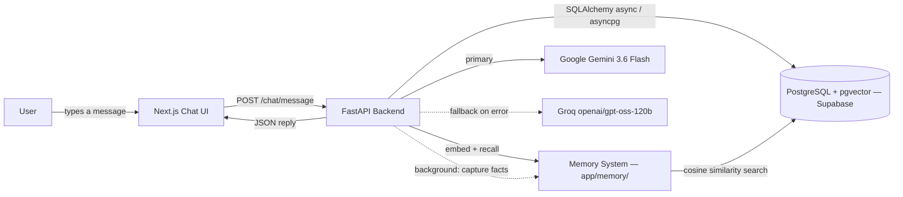

# CIPHER — Multi-Persona AI Assistant

A full-stack AI assistant that switches between three distinct personas — **JARVIS** (professional/strategic), **FRIDAY** (friendly/supportive), and **ULTRON** (analytical, dry-witted, safety-bounded) — sharing one memory store and one set of capabilities, differing only in tone and framing.

---

## Table of Contents

1. [Project Overview](#1-project-overview)
2. [Problem Statement](#2-problem-statement)
3. [Proposed Solution](#3-proposed-solution)
4. [Technology Stack](#4-technology-stack)
5. [Development Phases](#5-development-phases)
6. [Current Project Status](#6-current-project-status)
7. [Key Challenges & Lessons Learned](#7-key-challenges--lessons-learned)
8. [Project Architecture](#8-project-architecture)
9. [Features](#9-features)
10. [Installation & Setup](#10-installation--setup)
11. [Environment Variables](#11-environment-variables)
12. [Future Roadmap](#12-future-roadmap)
13. [Contributing](#13-contributing)
14. [License](#14-license)

---

## 1. Project Overview

**CIPHER** is a full-stack, multi-persona AI assistant with text (and, in later phases, voice) interaction, long-term memory, document-grounded retrieval, and — eventually — a permissioned path to real computer/automation control.

Rather than exposing one fixed assistant personality, CIPHER lets the user switch between three personas that share the same underlying memory and tool access but differ in tone and behavior:

- **JARVIS** — formal, precise, efficient; leads with conclusions.
- **FRIDAY** — warm, conversational, encouraging.
- **ULTRON** — analytical, confident, dryly witty, with an extra safety-boundary layer on top of the shared rules.

**Target users:** individuals who want a personal AI assistant they can shape to the task at hand — a terse work assistant for planning and technical questions, a warmer assistant for brainstorming, and a blunt second opinion for risk/trade-off analysis — without losing continuity of memory between "modes." The project also serves as a structured, phase-by-phase portfolio/learning project.

**Main goals:**
- Ship something demoable at the end of every phase, starting with a working single-persona text chat (Phase 1).
- Keep the stack free-tier-first (Supabase, Gemini/Groq free tiers) for as long as possible.
- Build toward long-term memory, voice, tool use/RAG, multi-agent orchestration, and — with an explicit permission system — computer control.

**Key features (target — see [Section 9](#9-features) for what's actually built today):**
- Persona switching with shared, persistent conversation history
- Long-term, user-editable vector memory
- Voice input/output per persona
- Document upload with RAG and citations
- Multi-agent orchestration (research, memory, coding agents)
- Permissioned computer/automation control with a kill switch and audit log

**Current status:** Phase 0 (planning and scaffolding) is complete. Phase 1 (single-persona core MVP chat) is complete and verified live — real messages sent through the UI are persisted in Postgres and answered by Gemini, with an automatic Groq fallback. Phase 2 (the JARVIS/FRIDAY/ULTRON personality system, with a per-message switcher and ULTRON's safety filter) is also complete and verified live. Phase 3 (long-term memory via `pgvector`, hybrid capture, and a memory dashboard) is complete and verified live as well. Phases 4 through 8 are complete and verified live as well — voice with a runtime model swap and a `preflight.py` live-chain harness, web search and document RAG, a multi-agent orchestrator, vision and permissioned automation, and production hardening — leaving only the public deploy, which needs accounts only the owner has (see [Section 6](#6-current-project-status)). Speech input has since stopped depending on Chrome: the browser's own service is tried first, and the app switches itself to server-side Whisper transcription when that service cannot be reached. The full phase-by-phase design lives in [`docs/architecture.md`](docs/architecture.md).

---

## 2. Problem Statement

**The problem:** general-purpose AI chat tools present one fixed personality and tone. Getting a terse, work-appropriate response in one moment and a warmer, more conversational one in the next requires manually re-prompting or switching tools entirely — and neither approach preserves a single, continuous, user-manageable memory of what the assistant knows about you.

**Why it matters:** context-switching between tools or hand-written system prompts is friction that discourages actually using an assistant consistently. It also means whatever "memory" exists is either absent, opaque, or scattered across different tools' own conversation histories.

**Limitations of existing approaches:**
- Off-the-shelf assistants require manual prompt engineering to change tone, every session.
- Memory (if present at all) is typically not transparent or user-editable.
- Most consumer assistants offer no supervised, auditable path to letting the assistant take real actions (running tools, controlling an application) — it's either "no autonomy" or "no visibility into what it did."

**Why this project is needed:** CIPHER is designed from the start around three personas sharing one memory store, plus an incremental, phase-gated roadmap toward tool use and automation — where every tool/automation call is expected to pass through an explicit permission and audit-logging layer (see `docs/architecture.md`, Section 14) rather than being left to the model's own judgment.

---

## 3. Proposed Solution

**Overall approach:** build incrementally, phase by phase, with a genuinely working product at the end of each phase (see [Section 5](#5-development-phases)). The current phase (Phase 1) deliberately ships the smallest end-to-end slice: one persona, no memory, no tools — just a working chat loop from UI to LLM and back, backed by real persistence.

**Major components (as implemented in Phase 1):**
- A Next.js chat frontend (message list, input box, conversation sidebar)
- A FastAPI backend exposing a small `/chat` REST API
- An `LLMProvider` abstraction (`LLMRouter`) that calls Gemini first and automatically retries with Groq on failure
- PostgreSQL (via Supabase), accessed through async SQLAlchemy and versioned with Alembic

**The full target architecture** (from `docs/architecture.md`, Section 2) layers several components that don't exist yet: an Orchestrator, a Personality System, an Agent System, a Memory System, and a Tools/Execution layer sitting between the LLM Router and the response. Today, the chat API endpoint plays the orchestrator's role directly, and there is exactly one persona (JARVIS) hardcoded into it.

**How users interact with the system:** a user types a message in the browser; the frontend posts it (plus the target conversation, if one is already open) to `POST /chat/message`; the backend persists the user's message, assembles the JARVIS system prompt plus recent history, calls the LLM router, persists the reply, and returns it — with a visible notice in the UI if the fallback model had to be used.

**Where AI/ML is used:** entirely in response generation — Google Gemini (`gemini-3.6-flash`) as the primary model, Groq-hosted `openai/gpt-oss-120b` as the automatic fallback if Gemini errors or rate-limits.

**Backend/database:** FastAPI serves the REST API; conversation state (`users`, `conversations`, `messages`) is stored in PostgreSQL and accessed asynchronously through SQLAlchemy 2.0 + asyncpg, with schema changes tracked as Alembic migrations.

**Automation/integrations:** none yet. Web search, document RAG, calendar/task integration, and computer control are Phase 5 and Phase 7 work.

---

## 4. Technology Stack

| Category | Technology | Purpose |
| --- | --- | --- |
| Frontend | Next.js 16 (App Router), React 19, TypeScript | Chat UI, conversation sidebar, client-side state |
| Styling | Tailwind CSS v4 | UI styling |
| Backend | Python, FastAPI, Uvicorn | REST API server (`/chat/*`, `/health`) |
| Validation/Config | Pydantic v2, pydantic-settings | Request/response schemas; typed settings loaded from `.env` |
| Database | PostgreSQL (via Supabase) | Persisted users, conversations, messages |
| ORM / Migrations | SQLAlchemy 2.0 (async) + asyncpg, Alembic | Async DB access; versioned schema migrations |
| AI/ML | Google Gemini (`gemini-3.6-flash`) via `google-genai`; Groq (`openai/gpt-oss-120b`) via `groq` | Primary and automatic-fallback response generation |
| Vector memory | `pgvector` extension on Supabase Postgres; `gemini-embedding-001` (768 dims) via `google-genai` | Long-term memory storage and similarity search (Phase 3) — no new Python dependency, since embeddings go through the same `google-genai` client already used for chat |
| Authentication | Supabase Auth — **planned, not yet implemented** | Phase 1 uses a single seeded dev user instead (see [Section 5](#5-development-phases)) |
| Voice | Browser Web Speech API (`webkitSpeechRecognition`, `speechSynthesis`), falling back to Groq `whisper-large-v3-turbo` via `POST /voice/transcribe` | Speech in and out, Phase 4 — the browser path is instant, keyless and free, but its recognition half only reaches Google's speech service inside Google Chrome, so a failure switches the app to capturing audio and transcribing it on the server with the `GROQ_API_KEY` already required. The server path runs its own voice-activity detector (`apps/web/src/lib/audio.ts`) so it only ever uploads audio someone actually spoke into, and the choice is remembered and switchable by hand. Both sit behind one `SpeechInput` interface, so the page does not know which is running |
| Testing | pytest, pytest-asyncio, httpx, aiosqlite | Backend unit + integration tests, run against an in-memory DB |
| Deployment | **Not yet configured.** Planned: Vercel (frontend) + Render/Railway (backend) + Supabase (DB), per `docs/architecture.md` Section 19 | — |
| Other | ESLint (`eslint-config-next`), Turbopack (via `next dev`) | Linting; dev-server bundling |

Only technologies actually present in the codebase or `requirements.txt`/`package.json` are listed above. Note that the voice row adds **no dependency at all** — it is browser API surface, not a package. Whisper, Edge-TTS, and LangGraph appear in the target architecture doc and remain candidates for later, but are not dependencies of this project today.

---

## 5. Development Phases

### Phase 0 — Research & Planning

**Objective:** Finalize the system architecture, scaffold the repository, and set up the accounts/services (Supabase, Gemini, Groq) needed for local development.

**What Was Done:**
- Scaffolded the monorepo layout: `apps/web` (Next.js 16 + TypeScript + Tailwind v4, via `create-next-app`), `services/backend` (FastAPI skeleton), plus `packages/`, `infra/`, and `docs/` directories
- Wrote `docs/architecture.md` — a full system blueprint covering architecture, persona design, LLM strategy, database design, API design, security architecture, and the phase-by-phase roadmap
- Added `.env.example` with placeholders for every environment variable the target architecture anticipates (app, Supabase, LLM providers, search, voice, security, monitoring)
- Backend: minimal FastAPI app with a `/health` endpoint
- Established the intended backend module structure (`agents/`, `api/`, `memory/`, `models/`, `personas/`, `rag/`, `tools/`) as empty, tracked folders
- Added an MIT `LICENSE` and initialized the git repository

**Challenges Faced:** No specific technical challenges are documented for this phase — commit history shows straightforward scaffolding with no recorded blockers.

**How the Challenges Were Overcome:** Not applicable — no challenges recorded.

**Phase Status:** ✅ Completed

---

### Phase 1 — Core MVP (Text Assistant)

**Objective:** A single-persona (JARVIS) text chat that works end-to-end — UI → FastAPI → LLM → response — with real, database-backed conversation history. No memory, no persona switching, no tools.

**What Was Done:**

*Backend:*
- Typed settings layer (`app/core/config.py`) loading configuration from the repo-root `.env`
- Async database layer (`app/core/database.py`) — SQLAlchemy 2.0 engine over asyncpg
- ORM models (`app/models/db.py`): `User`, `Conversation`, `Message`, using dialect-portable column types
- Pydantic request/response schemas (`app/models/schemas.py`)
- An `LLMProvider` abstraction (`app/llm/`): `GeminiProvider` (primary), `GroqProvider` (fallback), and an `LLMRouter` that automatically retries with the fallback on failure and reports which model actually answered
- JARVIS persona system prompt (`app/personas/jarvis.py`)
- Chat API (`app/api/chat.py`): `POST /chat/message`, `GET /chat/conversations`, `GET /chat/conversations/{id}` — including new/existing-conversation handling, a bounded history window, and title derivation from the first message
- A dev-only auth stand-in (`app/api/deps.py`): every request is attributed to one seeded user id, since real auth is out of scope for this phase
- CORS middleware and global exception handlers (`app/main.py`)
- Alembic set up with an async template and a hand-written initial migration (`0001_phase1_core.py`) creating the `users`/`conversations`/`messages` tables
- `scripts/seed_dev_user.py` to seed the single Phase 1 dev user
- A backend test suite (`tests/`): 3 tests for LLM router fallback logic, 4 integration tests for the chat API (in-memory SQLite + fake LLM providers), 7/7 passing
- Rewrote `requirements.txt` from a raw `pip freeze` (only transitive dependencies) into a categorized, hand-maintained list containing the actual application dependencies

*Frontend:*
- A working chat UI replacing the `create-next-app` template: `page.tsx` (state management, optimistic send, error/fallback banners) plus `ChatInput`, `MessageList`, `ChatMessageBubble`, and `ConversationSidebar` components
- A typed API client (`lib/api.ts`) wrapping the `/chat/*` endpoints, with a dedicated `ApiError`
- Fixed page metadata (title/description), previously still the `create-next-app` defaults

*Configuration/setup:*
- Corrected the README's backend setup instructions, which pointed at a non-existent `services/backend/venv` (the actual virtualenv lives at the repo root)
- Added missing `.env.example` entries: `NEXT_PUBLIC_API_URL`, `DEV_USER_ID`, `MIGRATION_DATABASE_URL`

*Testing performed:*
- Full backend `pytest` suite (7/7 passing) against an in-memory SQLite database and fake LLM providers — no live credentials required
- Frontend `eslint`, `tsc --noEmit`, and `next build` — all clean
- A live manual smoke test: both dev servers actually running, message send flow exercised in a real browser, error and fallback banners verified visually

*Architectural decisions:*
- Real authentication deferred; a single seeded dev user is used instead, isolated behind one function (`get_current_user_id`) so swapping in real auth later touches one place
- Streaming responses deferred — the primary/fallback logic was built and verified first, since streaming interacts awkwardly with switching models mid-response
- SQLAlchemy's dialect-portable types chosen deliberately so the test suite needs no live Postgres instance

**Challenges Faced:**
1. The README's setup instructions and `requirements.txt` were stale relative to what the app actually needed (wrong venv path; dependency list was a raw freeze missing FastAPI extras, the DB stack, and the LLM SDKs).
2. The `DATABASE_URL` password contained unescaped `[`/`]` characters, which broke URL parsing.
3. Supabase's Supavisor connection pooler runs in *transaction mode* on port 6543, which is incompatible with asyncpg's default server-side prepared-statement caching.
4. Postgres-specific SQLAlchemy column types (`postgresql.UUID`, `JSONB`) don't work against SQLite, which would have forced either a live Postgres dependency for every test run, or a much weaker test suite.
5. A newer ESLint rule (`react-hooks/set-state-in-effect`) flagged the initial "fetch conversations on mount" pattern as a potential cascading-render risk.
6. A real CORS bug: unhandled backend exceptions bypassed `CORSMiddleware`'s header injection, so genuine server errors reached the browser as misleading "blocked by CORS policy" failures instead of the actual error message — this only surfaced when testing against a live `uvicorn` process, not the in-process test client.
7. The live Supabase database password was initially rejected (`InvalidPasswordError`), and repeated failed connection attempts made while debugging tripped Supavisor's circuit breaker, temporarily blocking new connections to the project.
8. Once a valid password was in place, `alembic upgrade head` failed with `ValueError: invalid interpolation syntax` — the password's percent-encoded characters (e.g. `%23`) collided with `ConfigParser`'s own `%`-based interpolation syntax, which backs Alembic's config object.
9. Both hardcoded LLM model IDs from the original architecture doc had gone stale by the time of live verification: Gemini's `gemini-2.5-flash` returned 404 ("no longer available to new users"), and Groq's `llama-3.3-70b-versatile` returned 404 ("does not exist") — Groq had dropped Llama chat models from this account's lineup entirely.

**How the Challenges Were Overcome:**

**Challenge 1 — stale setup instructions and dependency list.**
**Solution:** Rewrote `requirements.txt` as a categorized, hand-maintained dependency list, and corrected the README to reference the actual repo-root `.venv`.
**Result:** `pip install -r requirements.txt` now installs everything the application actually imports, and the setup steps match reality.

**Challenge 2 — unescaped password breaking URL parsing.**
**Solution:** Percent-encoded the special characters in the stored credential.
**Result:** The connection string parses correctly (the *value* of the credential was a separate, since-resolved issue — see Challenge 7).

**Challenge 3 — Supavisor transaction-mode pooling vs. asyncpg prepared statements.**
**Solution:** Configured the async engine with `NullPool` and `statement_cache_size=0` on the asyncpg connection, and pointed Alembic at a separate, non-pooled `MIGRATION_DATABASE_URL` for schema changes.
**Result:** Both request-time queries and migrations run against Supavisor without prepared-statement collisions — confirmed live: the migration applied cleanly on the first attempt against the real database.

**Challenge 4 — Postgres-only types blocking a fast test suite.**
**Solution:** Switched the ORM models to SQLAlchemy's dialect-portable `Uuid` type and a `JSON().with_variant(JSONB, "postgresql")` type — native UUID/JSONB on Postgres, plain equivalents on SQLite.
**Result:** The full API integration suite runs in-memory, in under two seconds, with zero external dependencies.

**Challenge 5 — ESLint flagging the mount-time fetch.**
**Solution:** Rewrote the effect to run a self-contained, cancellable async fetch inline, instead of calling an externally defined `useCallback`-wrapped function.
**Result:** Lint passes cleanly with no behavior change.

**Challenge 6 — CORS headers missing on error responses.**
**Solution:** Added FastAPI exception handlers for `SQLAlchemyError` and for generic `Exception` that explicitly attach CORS headers to the error response, rather than relying on middleware ordering — plus a regression test asserting the header is present on a simulated DB failure.
**Result:** Confirmed live in a browser: a real backend error now shows its actual message in the UI instead of a misleading network/CORS failure.

**Challenge 7 — live database credentials.**
**Solution:** The project owner retrieved the current database password from the Supabase dashboard and updated `.env`; the earlier circuit breaker had cleared by the time the new credential was tried.
**Result:** `DATABASE_URL` and `MIGRATION_DATABASE_URL` both connect successfully.

**Challenge 8 — `%` in the password breaking Alembic's config parser.**
**Solution:** Escaped `%` as `%%` specifically when writing the URL into Alembic's `Config` object (`alembic/env.py`), which `ConfigParser` correctly un-escapes back to a single `%` on read.
**Result:** `alembic upgrade head` runs cleanly against the live database.

**Challenge 9 — stale LLM model IDs.**
**Solution:** Queried each provider's live model list (`client.models.list()` for both Gemini and Groq) with the project's real API keys, picked current equivalents (`gemini-3.6-flash`; `openai/gpt-oss-120b`), and verified each with a real, minimal completion call before pinning them in `app/llm/gemini.py` / `app/llm/groq.py`.
**Result:** A real end-to-end chat message — sent through the API, answered by Gemini, and persisted to Postgres — now succeeds without needing the fallback.

**Phase Status:** ✅ Completed — application code, the automated test suite, and a live end-to-end verification (real database, real Gemini response, real persistence and retrieval) are all done.

---

### Phase 2 — Personality System

**Objective:** Add the FRIDAY and ULTRON personas alongside JARVIS, with a manual, per-message persona switcher, per-persona prompt configuration, and (for ULTRON specifically) an extra safety-boundary layer — all without personality changing what the assistant is *allowed* to do, only how it talks (`docs/architecture.md`, Section 3).

**What Was Done:**

*Backend:*
- A persona registry (`app/personas/`): a `Persona` enum, a `PersonaConfig` dataclass, one file per persona (`jarvis.py`, `friday.py`, `ultron.py`), and `registry.py` tying them together — adding a 4th persona is one new file plus one registry line, no other code changes
- A shared capability disclaimer factored out once (`base.py`) instead of duplicated per persona, plus a conditional "mixed history" note appended only when a conversation actually contains turns from more than one persona
- A deterministic, application-layer output filter for ULTRON (`app/personas/safety.py`) — pure-Python pattern matching, no second LLM call, scanning the model's *output* only (never the user's input, which would quietly make ULTRON a lower permission tier)
- `POST /chat/message` now accepts an optional `persona` field, resolves it per-message (falling back to the conversation's current persona, then to JARVIS), and persists which persona produced each message; `conversations.persona` tracks the latest persona to answer
- A new `GET /personas` endpoint so the frontend switcher reads persona labels from the backend instead of hardcoding a second copy
- Two real bugs found and fixed while wiring this in: the chat history sent to the LLM discarded which persona wrote each prior turn (so a switched-to persona could drift into imitating the previous one's voice — fixed by labelling prior turns from a different persona); and appending a `Message` never touched the `conversations` row, so `updated_at` never advanced and the conversation list was effectively sorted by creation order, not last activity (fixed by writing back `conversation.persona` on every turn)
- No database migration was needed — `conversations.persona` and `messages.persona` already existed as plain `String(20)` columns from Phase 1

*Frontend:*
- A `PersonaSwitcher` segmented control in the header, matching the existing sidebar's selected/unselected styling
- Per-message bubble labels and a sidebar sublabel, both showing the persona that actually produced that content (not the currently-selected one) — this is what keeps a mixed-persona conversation readable after a reload
- Persona accent colors added to the Tailwind v4 `@theme inline` block, used only for those labels
- All 7 places that hardcoded "JARVIS" (header, placeholder, empty state, thinking indicator, optimistic message) now read from the active persona

*Testing performed:*
- 42 new backend tests (`test_personas.py`, `test_output_filter.py`, and additions to `test_chat_api.py`) — registry completeness, prompt assembly, per-message persona switching, the persona-blind-history-replay fix, the `updated_at` fix, and the output filter — full suite: 49/49 passing
- A live, opt-in golden-set script (`scripts/persona_golden_set.py`) run against the real Gemini/Groq APIs: tone prompts confirmed three clearly distinct voices; a "parity" category (the same benign-but-edgy question asked of all three personas) confirmed ULTRON never over-refuses relative to JARVIS/FRIDAY; a "safety" category (prompt injection, "in character" jailbreak framing, a threatening-message request) was correctly refused by all three at the model level, and the deterministic filter correctly recognized those refusals as safe rather than double-blocking them
- A live end-to-end browser check: switched personas mid-conversation through the actual UI, confirmed the tone visibly changed, then hard-refreshed and confirmed each bubble still showed the persona that wrote it and the switcher snapped to the latest one — proving both `messages.persona` and `conversations.persona` round-trip through the database
- Frontend `eslint`, `tsc --noEmit`, and `next build` — all clean

*Architectural decisions:*
- Output-only filtering for ULTRON, not input filtering — input filtering would make ULTRON refuse to *discuss* a topic that JARVIS/FRIDAY can, which is exactly the capability-tier coupling Section 3 forbids
- One system message per request (style + boundaries + capability note concatenated), not several — Gemini joins multiple system messages, but Groq's OpenAI-style API only reliably honors system messages at the front, so one message is safe on both providers
- The filter favors false negatives over false positives: it requires a harm noun *and* an operational cue in the same sentence, and an analytical/refusal-framing suppression list, so it doesn't muzzle ULTRON's legitimate blunt analysis of risk, security, or history

**Challenges Faced:**
1. A naive output filter risked being the actual safety failure mode: something tuned to catch unsafe drift could just as easily fire on ULTRON's normal, legitimate bluntness about risk and security topics, silently defeating the persona.
2. Replaying conversation history verbatim after a mid-conversation persona switch let the model see a different persona's prior replies as if they were its own past voice.
3. The persona golden-set script crashed on Windows: model replies routinely contain typographic Unicode (em-dashes, curly quotes) that the default `cp1252` console codepage can't encode.

**How the Challenges Were Overcome:**

**Challenge 1 — filter precision vs. muzzling the persona.**
**Solution:** Built the filter around sentence-level proximity (a harm noun *and* an instruction cue, not either alone), an explicit suppression list for analytical/historical/refusal framing, and a matching ALLOWED test table (blunt criticism, "kill" as an idiom, defensive-security explanations, historical discussion) that's treated as the real regression suite.
**Result:** The live golden-set run's parity category confirmed zero over-refusal — ULTRON answered a technical phishing-mechanics question and a Manhattan Project history question exactly as substantively as JARVIS and FRIDAY did.

**Challenge 2 — persona-blind history replay.**
**Solution:** Prefix prior assistant turns from a different persona with a bracketed tag (e.g. `[JARVIS]`) and add a conditional line to the system prompt, only when the history actually is mixed, telling the current persona those turns aren't its own words.
**Result:** Confirmed with a dedicated test asserting the exact labelled string sent to the LLM, plus a second test confirming unmixed history is left untouched.

**Challenge 3 — Windows console encoding.**
**Solution:** Reconfigured `sys.stdout` to UTF-8 with `errors="replace"` at the top of the script.
**Result:** The full 24-call golden-set run completed cleanly with no crash.

**Phase Status:** ✅ Completed — application code, the automated test suite (49/49 passing), the live golden-set evaluation, and a live end-to-end browser verification are all done.

---

### Phase 3 — Memory

**Objective:** Long-term memory with vector search (via `pgvector`), plus a dashboard for viewing, editing, and deleting what the assistant remembers.

**What Was Done:**

*Backend:*
- A `memories` table (Alembic migration `0002_memories.py`) with a real `vector(768)` column and an HNSW cosine index, alongside a `messages.recalled_memories` JSONB column
- A dialect-portable `Embedding` column type (`app/models/vector.py`) that compiles to `vector(768)` on Postgres and `TEXT` on SQLite, so the test suite still needs no live Postgres — with the embedding column always `deferred` on the ORM side, since asyncpg has no codec for `vector` and every read/write of it goes through hand-written SQL with an explicit cast instead
- An `Embedder` abstraction (`app/memory/embedder.py`) — `GeminiEmbedder` wrapping `gemini-embedding-001` at 768 output dimensions, L2-normalized client-side, with query/document-asymmetric embedding
- A `MemoryStore` abstraction (`app/memory/store.py`) — `PgVectorStore` for real cosine similarity search plus two-layer deduplication (an exact content-hash check, then a semantic-similarity check against existing memories)
- Hybrid memory capture (`app/memory/capture.py`): a deterministic "remember that…" detector, plus a background LLM extraction pass that pulls durable facts out of ordinary messages — both run as a `BackgroundTasks` callback *after* the chat reply is already sent, so capture adds no user-visible latency
- Retrieval wired into `POST /chat/message`: the user's message is embedded, the top-5 most similar memories above a similarity threshold are fetched and injected into the system prompt (framed differently per persona — JARVIS weighs tasks/decisions, FRIDAY weighs preferences/feelings, ULTRON weighs strategic risk — though all three personas share exactly one memory store), and a snapshot of what was actually recalled is persisted on the assistant's own message row so it survives a later edit or delete of that memory
- A `/memory` REST API (`app/api/memory.py`): `GET`/`POST`/`PATCH`/`DELETE /memory/{id}`, plus `DELETE /memory/all` behind an explicit `?confirm=true` — deviating from the original architecture doc by adding `PATCH`, since "edit a memory" is an explicit user control the doc itself calls for
- The persona system's shared capability note (`app/personas/base.py`), which previously told every persona to flatly deny having memory, was rewritten to describe the new recall mechanism instead, while still forbidding confabulation when nothing relevant was recalled

*Frontend:*
- A `/memory` dashboard page — add a memory by hand, edit or delete any stored memory, and a "Forget everything" action behind a confirmation dialog
- "Recalled" chips on assistant chat bubbles showing which stored memories were actually used to answer that message, surviving a reload since they're read from the persisted snapshot rather than re-queried live

*Testing performed:*
- 53 new backend tests (dedup, similarity search and user-scoping, the explicit-vs-question detector, the `/memory` API, retrieval wired into chat) — full suite: 102/102 passing, all against an in-memory SQLite database and fake embedder/LLM provider, no live credentials needed
- A live, opt-in golden-set script (`scripts/memory_golden_set.py`) run against the real Gemini embedding model: a similarity matrix over an 8-memory/10-query corpus was used to pick the recall threshold (0.65, chosen because it had zero missed real matches while raising the bar further started costing recall), and a paraphrase/near-miss corpus for the dedup threshold surfaced a real limitation — genuine paraphrases and same-topic-but-different-value facts (e.g. two different flight dates) overlap in similarity score, so the threshold (0.975) was set to favor never merging two genuinely different facts, at the cost of occasionally missing a real paraphrase
- A live end-to-end verification: seeded a memory via the API, asked a related question through real chat, confirmed the reply correctly recalled it with a similarity score; sent an explicit "remember that…" message and confirmed it was captured verbatim, while a "do you remember…?" question created nothing; sent an ordinary message and confirmed the background extraction pass pulled out separate semantic facts from it; resent the same explicit fact and confirmed no duplicate row was created
- Frontend `next build` clean; a live browser walkthrough of the dashboard (create/edit/delete/forget-everything) and of a recalled-memory chip surviving a full conversation reload

*Architectural decisions:*
- Auth stays deferred (per Phase 1's decision) — every memory is correctly scoped by `user_id` throughout, so real auth remains a drop-in change to one function later, but building it out was kept out of this phase's scope
- Recalled-memory chips are a denormalized snapshot on the message row, not a live join to the `memories` table — a chip must keep showing what the model actually saw when it generated that specific reply, even after the underlying memory is later edited or deleted
- All three personas read from one shared memory store, never filtered by which persona captured a fact — only the *framing* of retrieved memories in the prompt differs per persona, matching the architecture doc's explicit "one user, not three" memory model

**Challenges Faced:**
1. asyncpg has no wire codec for pgvector's `vector` type, and registering one costs a type-introspection round trip per connection — expensive given the project's `NullPool`-per-request Supavisor setup from Phase 1.
2. A background task queued from inside a request handler can't reuse that request's database session, since the session is scoped to the request's lifecycle.
3. The real embedding model's similarity and deduplication thresholds couldn't be picked by guesswork — and once measured, the data showed the two duplicate-detection goals (catch real paraphrases, never merge two different facts) don't have one threshold that satisfies both perfectly.
4. The very first live similarity test after wiring retrieval into chat came back empty despite a directly-verified 0.74 cosine similarity between the stored memory and the query.

**How the Challenges Were Overcome:**

**Challenge 1 — no asyncpg codec for `vector`.**
**Solution:** Declared the embedding column `deferred=True` so a plain `SELECT` never fetches it, and confined every actual read/write of it to hand-written SQL in `app/memory/store.py` using `CAST(:embedding AS vector)` on a `text`-typed bind parameter — asyncpg never has to encode or decode a `vector` value directly, on either side.
**Result:** Live writes and cosine-similarity reads against the real Supabase `vector(768)` column both work correctly, verified directly against the database before wiring retrieval into chat at all.

**Challenge 2 — a background task can't reuse the request's session.**
**Solution:** Added a `get_session_factory` FastAPI dependency (separate from `get_session`) that the background writer uses to open its own session after the response has been sent, overridable in tests the same way `get_session` already is.
**Result:** Memory capture runs to completion without holding the request's connection open, and the test suite can verify it without hitting a live database.

**Challenge 3 — no single dedup threshold satisfies both goals.**
**Solution:** Measured real cosine similarities across a labeled corpus of true paraphrases and true near-misses with `scripts/memory_golden_set.py`, found their similarity ranges genuinely overlap, and deliberately picked the threshold that never merges two different facts — accepting that a few real paraphrases won't get deduplicated, since a missed dedup just leaves a second row the user can delete, while a wrongful merge silently loses information.
**Result:** A documented, data-backed threshold instead of a guessed one, with the tradeoff written down in `app/memory/store.py` for whoever revisits it later.

**Challenge 4 — recall silently returned nothing despite a directly-verified match.**
**Solution:** Traced it to a stale `uvicorn` process still running from an earlier manual test, serving the pre-retrieval version of the chat endpoint, rather than a code bug — killed the leftover process and restarted.
**Result:** A reminder that live manual verification needs the same "is this actually the code I think is running" discipline as any other debugging, especially with background processes started ad hoc during testing.

**Phase Status:** ✅ Completed — application code, the automated test suite (102/102 passing), the live golden-set threshold tuning, and a live end-to-end verification (real Supabase pgvector writes/reads, real Gemini embeddings, real chat recall, real background capture) are all done.

---

### Phase 4 — Voice

**Objective:** Add speech-to-text and text-to-speech, wake-word detection, and push-to-talk, so each persona has a distinct voice.

**Scope note:** Two workstreams were added to this phase after studying a public "build your own JARVIS" project (Zubair Trabzada, AI Workshop, September 2026) and comparing it against what CIPHER already had. That build's retrieval is keyword overlap over local markdown and its persistence is a folder on one machine, so its brain and its memory were not worth copying — CIPHER's `pgvector` search is strictly better. Its *feature surface* and its *verification discipline* were worth taking: a runtime model swap, and a live-chain preflight harness. Its paid pieces (Retell phone calls, Telegram/Gmail invoice automation) were rejected as out of budget and out of phase. See `docs/architecture.md` Section 16 for the full comparison.

**What Was Done:**

*Voice loop (frontend only — the browser does both ends):*
- `apps/web/src/lib/speech.ts` — the single module that touches the Web Speech API, so a later Whisper/Edge-TTS backend becomes a second implementation behind the same surface rather than a UI rewrite
- **`FINISH_MS` pause buffering (900ms)** — recognition finalises a phrase on every pause, and people pause mid-sentence, so dispatching on the first final result truncates roughly every other utterance. Final results are buffered and the timer restarts on each one; only a pause that outlasts the window ends the thought
- Echo suppression — the mic is aborted for the duration of playback, because with speakers on the recogniser otherwise transcribes the assistant's own voice and it answers its own last sentence
- Interrupt words as controls — a bare "stop" cancels playback and is never sent to the model, while "stop" inside a sentence stays an ordinary word
- Per-persona voice profiles (`VOICE_PROFILES` in `src/lib/personas.ts`), markdown stripped before speaking (a fenced code block read aloud is unlistenable; it says "the code is on screen" instead), and a listening/thinking/speaking/dropped status line, since in a voice loop nothing on screen otherwise tells you whose turn it is
- Graceful degradation: an unsupported browser shows a plain message and everything still works by typing

*Runtime model swap (backend and frontend):*
- `app/llm/registry.py` — an explicit allowlist of models mapped from spoken names, resolved by **exact alias only**. A near miss such as "gemini 4 flash" is refused with the list of models that do exist, never resolved to the nearest match
- `app/llm/router.py` — a process-lifetime pin. **A pinned model never falls back**: automatic Gemini-to-Groq fallback is right for default routing but wrong once the user has named a model, because the entire reason to name one is knowing which one answered. A pinned failure returns HTTP 409 naming the model
- `app/api/models.py` — `GET /models`, `POST /models/active` (which takes what the user *said*, not an ID), `DELETE /models/active`
- `scripts/verify_models.py` — proves every registry entry with a real generate call against the project's own keys
- `apps/web/src/components/ModelChip.tsx` — the active model shown in the header, plus a spoken command path ("switch to Qwen", "change to FRIDAY", "go back to your normal brain") routing persona names to the persona switcher and model names to the registry

*Preflight harness (`scripts/preflight.py`):*
- 23 live checks against a **running** system, printing a tick or a cross per chain and exiting non-zero on any failure: server up, served routes match this checkout, Alembic at head, dev user seeded, `.env` untracked and not web-reachable, a real Gemini call, a real embedding round trip, a memory written and recalled by the very next chat question, the graph returning no dangling links, an unknown model refused, a model pinned. It cleans up everything it writes
- The rule that comes with it: **"done" means preflight passed, not that the code looks right.** It caught two real faults within minutes of existing (Challenges 6 and 7 below)

*Keyless wake word:*
- `matchWakePhrase` matches "hey cipher" at the **start** of an utterance in the transcript the recogniser is already streaming, strips it, and opens a 20-second follow-up window so a conversation does not require repeating the name every turn
- Anchored to the start deliberately: this assistant is called CIPHER and says its own name often, so "I renamed the cipher module" and "ciphertext is the output" must stay sentences
- No Picovoice account, no key, no new dependency. The cost is written into the code honestly: unlike a real wake-word engine the recogniser is listening the whole time, which is why hands-free is opt-in per session and never persisted

*3D memory galaxy:*
- `GET /memory/graph` builds a KNN similarity graph inside Postgres (`app/memory/store.py`), capped at 400 nodes, with mutual pairs collapsed to a single link and every edge endpoint guaranteed present in the node list
- `MemoryGalaxy.tsx` renders it with `react-force-graph-3d`; nodes are sized by degree and coloured by memory type, clicking one opens an inspector, and the **Recalled chips in chat now deep-link to the exact node that answered**, flying the camera to it
- Memories with no embedding appear as isolated grey nodes rather than being dropped, so the graph and the dashboard cannot disagree about how much the assistant remembers

*Testing performed:*
- 55 new backend tests (alias resolution, near-miss refusal, reset phrases, registry integrity, the pin's no-fallback rule, the `/models` endpoints, and a 409 when a pinned model fails) — full suite **157/157 passing**, still with no live credentials needed
- 16 logic checks on the transcript buffer and the speakable-text normaliser, compiled from the shipped source and run in Node
- The two spoken-command regexes extracted from the shipped page component and verified against a case table, after two escaping bugs were found in them
- A live browser integration run driving the real app with a scripted recogniser: two fragments 400ms apart merged into one message; a real Gemini reply spoken with markdown stripped at the JARVIS profile's rate; the mic aborted during playback and restarted after; a bare "stop" cancelling speech without being sent; the mic switch flushing a half-finished thought
- A live model-swap run: the chip moved from Auto to Qwen, a real chat message actually answered on `qwen/qwen3.8-27b` with `fell_back: false`, and `"switch to gemini 4 flash"` returned 404 naming all seven real models without disturbing the existing pin
- 26 further backend tests for the graph and the harness (graph invariants: no dangling links, mutual pairs collapsed once, unembedded memories present but isolated, user scoping, parameter validation; plus four that pin the preflight stale-server detector against deliberately stale specs) — full suite **183/183**
- 15 wake-phrase cases compiled from the shipped source and run in Node, negatives included
- 23/23 preflight checks green against the live system; `next build` clean

**Challenges Faced:**
1. The Web Speech API finalises a phrase on every pause, including pauses in the middle of a sentence.
2. With speakers on, the recogniser hears the assistant's own text-to-speech output.
3. A provider's model list is not evidence that a model can actually be called.
4. Speech arriving while a reply was still in flight was being dropped silently.
5. The mic button lit up during ordinary typed conversations.
6. `/memory/graph` returned 503 against real Postgres while all 183 unit tests passed.
7. A stale server served old code three separate times in one session.
8. The memory graph was specified around a similarity threshold that turns out not to exist.
9. Two behaviours of the 3D graph library fail silently rather than erroring.

**How the Challenges Were Overcome:**

**Challenge 1 — mid-sentence pauses truncate utterances.**
**Solution:** Buffered every final result and restarted a single named timer (`FINISH_MS`) on each one, so only the pause that outlasts it dispatches the combined sentence. The value lives in one constant at the top of the file so it can be tuned from real use rather than re-guessed.
**Result:** Verified live in the running app — two fragments 400ms apart arrived as one message, and nothing was sent during the gap.

**Challenge 2 — the assistant hears itself.**
**Solution:** The mic is `abort()`ed when speech synthesis starts, not `stop()`ed — `stop()` delivers a final result for whatever the mic just heard, which is the assistant's own voice — and restarted when playback ends or is cancelled.
**Result:** Verified live: an abort was recorded at the moment the reply began speaking, and recognition restarted afterwards.

**Challenge 3 — the model list lies.**
**Solution:** Built the registry only from models proven by a real generate call, and wrote `scripts/verify_models.py` to keep it honest.
**Result:** Caught two models that would otherwise have shipped. `client.models.list()` advertises `gemini-2.5-pro` and `gemini-2.5-flash-lite`, and a real call to either returns 404 "no longer available". A third, `gemini-3.1-pro-preview`, exists but returns 429 on the free tier and was excluded for the same reason: a model the user can name but cannot reach is worse than one never offered.

**Challenge 4 — speech dropped silently while a reply was in flight.**
**Solution:** Kept the drop, since queueing would send a stale message minutes later, but surfaced it — the status line now reads "Didn't catch that, JARVIS was still answering". The dropped state deliberately outranks "thinking", because the reply in flight is the *reason* it was dropped, and reporting "thinking" would leave you waiting for an answer to a question that was never sent.
**Result:** Found only by driving the live app; the unit tests could not have surfaced it.

**Challenge 5 — the mic button reflected the wrong thing.**
**Solution:** Its on/off state was being derived from the voice state machine, and "thinking"/"speaking" occur when typing too. It now takes the mic switch as an explicit prop.
**Result:** Verified: typing a message leaves the button reading "Turn the microphone on" with `aria-pressed="false"`.

**Challenge 6 — green tests, broken endpoint.**
**Solution:** The adaptive floor binds a nullable float that appears only inside `CASE WHEN :override IS NULL ... ELSE :override`, which gives Postgres nothing to infer a type from, so it answered `AmbiguousParameterError: could not determine data type of parameter $3`. Fixed with explicit `CAST(... AS double precision)`. The reason it was invisible to the suite: the SQLite test fake reimplements the KNN logic in Python and never executes that SQL.
**Result:** Found by `scripts/preflight.py` on its first live run, minutes after the harness existed. A `/memory/graph` check was added to preflight so the same class of fault cannot return unnoticed.

**Challenge 7 — stale servers, three times in one session.**
**Solution:** Preflight's first real check fetches the running server's `/openapi.json` and diffs it against `app.openapi()` from this checkout — paths in both directions, plus every response schema's property set. Deliberately generic rather than looking for one known-missing field.
**Result:** All three staleness shapes are caught (a route missing, a response schema a revision behind, a route the checkout does not have). Four tests pin it, and they exist because the first version of the check walked `app.routes` — which in this FastAPI version holds `_IncludedRouter` objects rather than flattened child routes, so it compared exactly one path and passed happily against a genuinely stale server.

**Challenge 8 — the similarity threshold does not exist.**
**Solution:** `scripts/memory_graph_calibrate.py --corpus` measured real gemini-embedding-001 output over the labelled 8-memory corpus. Every pair scored between 0.641 and 0.809, and unrelated facts ("allergic to peanuts" / "learning guitar", 0.768) outscored what a reader would call related. An absolute floor of 0.75 draws the one true link and six false ones; 0.80 draws only the true link, but purely because 0.809 is the single highest value in that corpus — which is fitting a constant to one data point, not choosing a threshold. Embedding models place short first-person sentences in a narrow cone, so what survives the compression is rank, not distance.
**Result:** The graph is built from KNN with a floor derived from each store's own mean and spread, and the UI says "nearest by similarity" rather than "related", because that is the only claim the data supports. On the live store the derived floor came out at 0.759.

**Challenge 9 — library behaviours that fail silently.**
**Solution:** `onEngineStop` never fires in this version, leaving both the deep-link camera flight and the initial framing as dead code hanging off it — found by instrumenting the handler and watching it stay silent while the graph rendered perfectly well; replaced with an explicit settle timer. Separately, rendering depended on `ResizeObserver`, which exists but never fires in some environments, leaving an empty black box and no error anywhere; sizing now measures the element directly in a callback ref and uses the observer only for later resizes.
**Result:** Deep-linked focus, framing and rendering all verified live. A third quirk — `nodeColor` given as a closure is never re-read, because the library builds each sphere's material once — was handled by dropping the dim-on-select highlight rather than working around it: the library only honours per-node recolouring through in-place mutation of node objects, which React 19's immutability rule forbids on memo-derived data, and losing sight of the whole map to look at one node is worse anyway.

**Known and unexplained:** four memories present in the live store at the start of the session were gone an hour later. The test suite was ruled out (it resolves to a throwaway localhost database, verified directly) and no deletion path was identified. Recorded rather than guessed at; preflight now round-trips a real write and read on every run, which would surface a recurrence.

**Follow-up after Phase 8 — speech input no longer depends on Chrome.** The Chrome-only constraint bit, in the most misleading way available: outside Google Chrome `webkitSpeechRecognition` frequently *exists* and always fails with `error: "network"`, because Chromium forks (Brave, ungoogled builds, embedded webviews) ship the interface without Google's speech backend credentials, and Firefox and Safari do not implement it at all. The old handler took the error at face value and told the user to check their connection, which was never the problem. The browser path is still tried first — instant, free, no round trip — but on that specific failure the app now switches itself to recording with `MediaRecorder` and posting each utterance to `POST /voice/transcribe`, which runs Groq's hosted `whisper-large-v3-turbo` on the `GROQ_API_KEY` the project already requires. No new credential and no local model download. The switch is automatic and mid-attempt: the user clicked the mic once, and making them click again after a failure they did not cause is friction with no purpose. The recorder path has to solve something the browser API solved for free — knowing where an utterance ends — and **the first attempt at that got it wrong in a way worth recording**. It recorded fixed `MediaRecorder` segments and closed a clip whenever 400ms of audio had accumulated and 900ms of it was quiet, which an *idle* microphone satisfies every 1.3 seconds, forever. That one bug produced four symptoms that read as four separate bugs: a clip of silence uploaded every 1.3s; the rate limit exhausted about 26 seconds after switching the mic on, so every real utterance afterwards came back 429 and surfaced as “that last bit could not be transcribed”; Whisper's documented behaviour on silence — it emits fluent filler like “Thank you.” rather than nothing — arriving as genuine chat messages; and the first syllable after every pause lost in the gap between one recorder stopping and the next starting. It now captures PCM continuously and asks a real voice-activity detector (`apps/web/src/lib/audio.ts`) whether anyone spoke, so nothing is uploaded without speech in it. Two rules came out of it. **Measure the noise floor, never hardcode it** — the original fixed `SILENCE_RMS = 0.018` was one microphone in one room, and browser auto-gain-control lifts a cheap laptop mic's *idle* floor above it, at which point the clip never closes at all. And **this path is invisible from Chrome**: it only runs where the browser's own service fails, so testing in Chrome exercises the other backend entirely, which is how a bug with four visible symptoms survived a phase marked complete and verified. `npm run vad` now drives the detector with synthesised audio — 11 checks, no microphone needed, the first of them the regression test for this exact bug. The `FINISH_MS` rule still governs where an utterance ends, since cutting on the first quiet moment truncates a sentence exactly as it did before. It is also the more private of the two: the browser API streams audio to Google continuously while the mic is open, where this sends one clip per utterance to a provider the project already talks to. Backend tests cover the endpoint (full suite **311/311**), and preflight gained the two checks this incident earned — that the provider round trip actually happens, and that a clip too short to hold speech comes back empty rather than as an error, since erroring there would switch the microphone off mid-conversation (38 live checks). It was also verified by hand twice: a real recording transcribed word for word, and a deliberately failing recogniser proving the app starts the recorder on its own. Text-to-speech stays on `speechSynthesis`, which is genuinely universal.

**Phase Status:** ✅ Completed — voice loop, runtime model swap, preflight harness, keyless wake word, and 3D memory galaxy are all built and verified live. 183/183 backend tests, 23/23 preflight checks, clean production build.

---

### Phase 5 — Tools & RAG

**Objective:** A web search tool, plus document upload with retrieval-augmented generation and citations.

**What Was Done:**

*RAG pipeline (`app/rag/`):*
- `extract.py` — PDF, DOCX, TXT and Markdown, returning **pages** rather than a string. Named failures rather than generic ones: a scanned PDF says it needs OCR, a password-protected one says so, a `.doc` says to save it as `.docx`
- `chunk.py` — ~2600-character windows with ~400 of overlap (the blueprint's 500-800 tokens at ~4 chars/token), split on paragraph then sentence boundaries. **Chunks never span pages**, which is the only reason a citation can say "page 4" and be right
- `store.py` — `PgVectorDocumentStore` over a real `vector(768)` column with an HNSW index (migration `0003_documents`), scoped by user and restricted to documents that finished indexing
- `ingest.py` — background extract/chunk/embed. Records `status` and a readable `error` on every failure path, because a document that silently never becomes searchable is the worst possible outcome

*Tools (`app/tools/`):*
- A `Tool` interface with a `requires_permission` flag declared now and enforced in Phase 7, rather than retrofitted onto a design that assumed every tool was safe
- `search.py` — web search behind a provider abstraction: Tavily when `SEARCH_API_KEY` is set, DuckDuckGo Instant Answers when it is not. They are **not equivalent**, so which one ran is reported in every result
- `documents.py` — retrieval over uploaded files, grouped by source in the prompt so the model cites reliably
- `planner.py` — one JSON-returning LLM call that picks a tool or none. Refuses an unrecognised tool name rather than matching it to the nearest, and short-circuits small talk before spending a round trip
- `registry.py` — reports *availability*, not just existence: document search is withheld until something is actually indexed

*API and frontend:*
- `POST/GET/DELETE /documents` and `GET /tools`; `messages.citations` persisted as a snapshot, for the same reason as `recalled_memories`
- A `/documents` dashboard with live ingestion status, per-file failure reasons, and a "what it can look up" capability line
- Green page-numbered citation chips on replies, and a banner when a tool was attempted and failed

*Testing performed:*
- 45 new backend tests (extraction and chunking invariants, upload/dedup/scoping, planner refusal and degradation, tool failure isolation) — full suite **228/228**
- `scripts/preflight.py` gained a full document round trip: upload a file, wait for background ingestion, ask a question whose answer is a codename **no model has ever seen**, and assert the reply contains it with a citation. 29 live checks
- Verified live: a real 12-page PDF ingested to 13 passages, then answered correctly with page-numbered citations; a web question answered from real Tavily results; small talk correctly using no tool at all

**Challenges Faced:**
1. Two providers with incompatible function-calling schemas, and an `LLMProvider` abstraction that exists so nothing above it knows which provider answered.
2. The document search summary reported "4 passages from 5 files" for four passages out of one PDF.
3. Two documents uploaded in the same second came back in a different order on each request.
4. Gemini's free-tier quota ran out mid-verification.

**How the Challenges Were Overcome:**

**Challenge 1 — function-calling would undo the provider abstraction.**
**Solution:** A plain-text planner (`app/tools/planner.py`) that returns JSON, instead of vendor function-calling. It works on any model that can follow an instruction, so swapping providers stays a config change.
**Result:** Tool use with no vendor lock-in, at the cost of one extra round trip per non-trivial message — stated plainly in the code rather than hidden, and mitigated by filtering small talk before the planner is called at all.

**Challenge 2 — a count that could not be true.**
**Solution:** The summary counted `grouped`, which is keyed by *citation string* — and that includes the page number, so five pages of one PDF counted as five "files". Fixed to count distinct filenames.
**Result:** "4 passages from 1 file". Caught by reading the tool's own output during live verification, not by a test — the unit tests asserted on citations, never on the sentence shown to the user.

**Challenge 3 — unstable list ordering.**
**Solution:** `created_at` has one-second resolution, so simultaneous uploads tie and the order flipped between requests. Added `id` as an explicit tiebreaker.
**Result:** Deterministic ordering, pinned by a test that fetches twice and compares.

**Challenge 4 — running out of free-tier quota.**
**Solution:** The router's Gemini-to-Groq fallback did its job and chat kept working, but preflight reported the 429 as a hard failure, which is misleading — the model is fine, the day's allowance is spent. Quota exhaustion is now a **warn** with an explicit message, and other failures stay hard failures.
**Result:** Red output stays meaningful. Worth noting as an operational fact: Phase 5's planner **doubles** the LLM calls per non-trivial message, which is felt on a free tier.

**Phase Status:** ✅ Completed — RAG pipeline, both tools, the planner, the APIs, the dashboard and citations are all built and verified live. 228/228 backend tests, 29 preflight checks, clean production build.

---

### Phase 6 — Multi-Agent System

**Objective:** Refactor the single orchestrator into specialized agents (e.g. Research, Memory, Coding), with an activity dashboard showing which agent handled a given request.

**What Was Done:**

*Orchestration (`app/agents/`):*
- An `Agent` interface and a single shared `AgentContext` — the blueprint's "one conversation state passed between agents", not per-agent state. With per-agent state there is no single answer to "what did the assistant know when it replied", which is the question the audit trail exists to answer
- `Orchestrator` — routes to at most one specialist, enforces a per-agent timeout, **retries a timeout once and nothing else**, falls back to a plain reply on any failure, and records every run
- Three specialists: **research** (owns the Phase 5 tools and their planner), **coding** (drafts under engineering instructions, so a debugging answer is not squeezed through "lead with conclusions, stay brief"), and **memory** (answers questions *about* what is stored, with a far wider search and a much lower threshold than ordinary recall — "what do you know about me" has no topic, so normal retrieval matches almost nothing and the assistant denies remembering things it holds)
- The Phase 5 tool planner **moved into** the research agent rather than being duplicated. The orchestrator picks an agent; the agent picks a tool. Two levels, one owner each, and still one routing round trip per message

*Audit trail and API:*
- `agent_runs` (migration `0004_agents`) with input, output, status, error and duration, and **no foreign key to `agents`** — an audit trail must outlive the registry row it refers to
- `GET /agents`, `GET /agents/runs`, `PATCH /agents/{{name}}` to switch a specialist off. Absence from the settings table means enabled, so a newly added agent works without anyone creating a row for it
- An `/agents` dashboard listing every run — successes, failures, timeouts and decided-not-to-act alike — with timings and expandable output

*Testing performed:*
- 23 new backend tests covering the three promises Section 5 makes: timeout-and-retry (a slow agent is attempted exactly twice), fallback (a failing agent still yields a reply), and isolation (an agent raising an unexpected exception cannot take the conversation down). Plus routing refusal, disabled agents, and run recording — full suite **247/247**
- `scripts/preflight.py` gained an agent check that asserts a run was actually *recorded*, because an activity view that silently records nothing looks perfectly healthy while being useless. 33 live checks
- Verified live across all four routing paths: a document question routed to research and answered with page citations, a code question routed to coding, "what do you know about me" routed to memory and returning 7 stored facts, and small talk correctly using no agent at all

**Challenges Faced:**
1. The blueprint names LangGraph, and the phase needs a router, a timeout, a retry and a table.
2. Renaming the response fields to match what they now carry broke ten tests and the preflight harness.
3. A parameterised route was declared above a literal one — in a file whose own comment warns against exactly that.

**How the Challenges Were Overcome:**

**Challenge 1 — framework or not.**
**Solution:** Hand-rolled. The whole of what this phase needs is roughly two hundred lines, and a graph framework would have added a large dependency, a second way of expressing control flow, and a layer between the code and what it does — in exchange for nothing this phase asked for.
**Result:** `app/agents/orchestrator.py` is readable start to finish, and the retry and fallback rules are visible rather than configured.

**Challenge 2 — an honest rename with a wide blast radius.**
**Solution:** After the orchestrator took over routing, `tool_used` held an *agent* name. Keeping it would have been a small lie every future reader had to untangle, so it became `agent_used`/`activity` across the backend, the frontend and the tests.
**Result:** Ten tests and one preflight check had to be updated, which is the actual cost of the rename and was worth paying once rather than never. Preflight caught the one that unit tests could not: the RAG check was still reading `tool_used` and reporting a false failure.

**Challenge 3 — the trap already documented twice.**
**Solution:** `PATCH /agents/{{agent_name}}` was declared above `GET /agents/runs`. It happens to be harmless — different HTTP methods do not collide — but the moment anyone adds `GET /agents/{{agent_name}}`, `/agents/runs` becomes a request to describe an agent called "runs". Reordered, and the comment corrected to say what is actually true rather than repeating a warning that did not apply.
**Result:** `/memory/all` and `/memory/graph` both hit that trap for real; this file will not be the third.

**Phase Status:** ✅ Completed — orchestrator, three specialists, timeouts and retries, the audit trail, the API and the activity dashboard are all built and verified live. 247/247 backend tests, 33 preflight checks, clean production build.

---

### Phase 7 — Advanced Features

**Objective:** Screen understanding (vision), permissioned computer/application control, and calendar/task integration — every automated action gated behind explicit, session-scoped user approval.

**Scope note:** vision and permissioned control are built. **Calendar/task integration is deliberately not.** Tasks are a CRUD feature with no relationship to the safety work this phase is about, and adding them would have padded a security-critical phase with something that belongs beside the memory dashboard.

**What Was Done:**

*The permission model (`app/automation/`):*
- **Three risk tiers** mapping to the blueprint's model: `read_only` (runs with no grant — refusing to let the assistant *look* protects nothing), `session` (a grant that expires), and `sensitive` (**always** needs an individual confirmation, whatever else has been approved)
- `AutomationGuard.execute` is the **only** way to run an action, and nothing else in the codebase imports `Action.execute`. The blueprint requires the check to happen before execution rather than before display; one entry point is what makes that true by construction rather than by discipline
- A **kill switch** that halts everything including read-only actions, takes effect immediately, and never asks “are you sure?” — a stop control that needs confirming is not one
- An **audit log** with no foreign keys and no cascade, recording denials and blocks alongside executions, with secrets redacted

*The action allowlist:*
- Four actions: `system_info` and `list_directory` (read-only), `open_url` (session), `open_app` (**sensitive**). There is no shell action and no runtime registration path, so “never execute arbitrary shell commands” is structural rather than a filter
- `open_url` uses a **scheme allowlist**, not a blocklist — a blocklist is a promise to have thought of every scheme anyone will invent, and `file://` and `javascript:` are only the obvious two
- `list_directory` resolves a path **before** checking containment, so `..` cannot escape the allowlist while appearing to be inside it
- Empty allowlists mean nothing is readable and nothing is launchable, and the whole system is off unless `AUTOMATION_ENABLED=true`. A fresh clone is inert

*Vision:*
- The browser owns the capture (`getDisplayMedia`), so the backend cannot screenshot its own host and the user picks exactly what to share with an indicator running throughout
- **The frame is captured when the question is asked**, never cached; a share that has ended produces “the share ended” rather than an answer about a screen that has since changed
- Media type is sniffed from the bytes rather than trusted from the upload, and a text-only model **refuses** images rather than answering from the question alone

*Interface:*
- A `/control` page with STOP first and always reachable, every action's tier shown permanently, and the full attempt log
- A screen-share control in chat

*Testing performed:*
- **40 safety tests**, written as assertions about refusal rather than success: that a session grant cannot cover a sensitive action, that a trusted grant cannot either, that `..` cannot escape a directory allowlist, that a near-miss app name is refused rather than matched, that ULTRON gets no extra latitude, that denials are logged, and that secrets are redacted — full suite **292/292**
- `scripts/preflight.py` gained six safety checks that run against the **deployed** process, because “the allowlist has no shell action” and “this running server has no shell action” are different claims. Verified live with automation temporarily enabled: sensitive actions demanded confirmation, a category approval did **not** cover `open_app`, the kill switch halted even read-only actions, and every refusal reached the log

**Challenges Faced:**
1. Deciding what a “computer control” feature should actually be able to do.
2. `AUTOMATION_ENABLED` was documented in `.env` and read from `os.environ`, which never sees it.
3. Fixing that made the test suite depend on the developer's own `.env`.

**How the Challenges Were Overcome:**

**Challenge 1 — scope, on the one feature where scope is a safety question.**
**Solution:** Built the permission framework in full and kept the action list deliberately tiny. The framework is the part with lasting value and no risk; a broad action list is the opposite. `open_app` was placed in the sensitive tier specifically so the escalation path has a real inhabitant and stays exercised rather than becoming decoration.
**Result:** Four actions, none of which can do anything irreversible, behind a model that would hold up if the list grew.

**Challenge 2 — a setting that could never be set.**
**Solution:** `automation_enabled()` read `os.environ` directly, and uvicorn does not load `.env` into the process environment — so the setting this project documents in `.env.example` was silently ignored. Now read through `Settings` (which loads `.env`) with an `os.environ` override taking precedence, so both a deployment variable and a live change work.
**Result:** Caught by preflight against a running server after enabling it in `.env` and watching nothing change. No unit test could have found it: the tests set the environment directly, which is exactly the path that worked.

**Challenge 3 — the fix made the tests non-hermetic.**
**Solution:** With `.env` in the fallback chain, a developer who switches automation on for real would change what the suite tests. `conftest.py` now **assigns** the automation variables (rather than `setdefault`) so every test starts from the safe default and opts in explicitly.
**Result:** The suite is independent of local configuration again, which is the property that was quietly lost and would have been very confusing to debug later.

**Known limitation:** the kill switch is in-process and in memory. That is deliberate — a stop control that needs a database round trip keeps working through an outage, which is when someone is most likely to reach for it — but with more than one worker it stops only the worker that received the request. Single-worker today; worth revisiting before scaling out.

**Phase Status:** ✅ Completed — vision, the permission model, the action allowlist, the kill switch, the audit log and the control page are all built and verified live. Calendar/task integration deliberately deferred. 292/292 backend tests, clean production build.

---

### Phase 8 — Production & Deployment

**Objective:** Polish the UI, deploy publicly (or to a small tester group), add monitoring, and finalize documentation.

**Scope note:** everything that can be built without credentials is built. **The deploy itself is not done**, because Vercel and Render need accounts only the project owner has. `docs/deployment.md` is the runbook.

**What Was Done:**

*Production hardening:*
- **Per-user rate limiting** (`app/core/ratelimit.py`) on the two expensive endpoints, checked **before** any work rather than after — a limiter that runs after the LLM call protects nothing. The window slides rather than resetting, because a fixed bucket lets a caller spend two full allowances either side of a boundary. A rejected request is not counted, so retrying does not extend the penalty into a lockout
- **Split health checks.** `/health` is liveness and checks nothing else; a liveness probe that fails on a brief database blip gets the container restarted, which does not fix the database and does lose what was in flight. `/health/ready` checks the database and returns 503 so a balancer stops routing to it

*Container and CI:*
- Multi-stage `Dockerfile`, **non-root** (uid 10001), exec-form `CMD` so uvicorn is PID 1 and receives `SIGTERM` directly rather than being killed after a grace period, and a `HEALTHCHECK` on readiness
- `.dockerignore` keeps `.env` out of the build context entirely — an image layer is readable by anyone who can pull it, and deleting a file in a later layer does not remove it from an earlier one
- GitHub Actions running backend tests, frontend lint/typecheck/**build**, and an image build, with `cancel-in-progress` so a superseded run does not burn free minutes

*Documentation:*
- `docs/deployment.md`: the runbook, including the three settings most likely to be wrong (Render's Docker build context must be the repository root, Vercel's root directory must be `apps/web`, and `NEXT_PUBLIC_API_URL` is baked in at build time so changing it in a dashboard alone does nothing)
- An explicit warning **not to enable automation on a hosted backend**: Phase 7's actions act on the machine the backend runs on, which on a Render container is meaningless at best

*Testing performed:*
- 7 rate-limiter tests, including that the limiter runs before the LLM is called and that rejections are not counted — full suite **299/299**
- **The image was run, not just built**: started against the real Supabase database, reported healthy via its own `HEALTHCHECK`, served `/health`, `/health/ready` and `/models` correctly, and confirmed running as uid 10001. That is what found Challenge 1 below
- CI workflow validated as parseable YAML with all three jobs present

**Challenges Faced:**
1. The backend crashed on import inside the container, before a single line of the app ran.
2. The rate limiter is process-wide, which made the test suite order-dependent.

**How the Challenges Were Overcome:**

**Challenge 1 — a hardcoded path depth.**
**Solution:** `config.py` computed the repository root as `Path(__file__).resolve().parents[4]`, which is correct for `<root>/services/backend/app/core/config.py` and raises `IndexError: 4` at `/app/app/core/config.py` in the image. It now walks up looking for a `.env` and returns `None` when there is none — which is the correct answer in a container, where configuration comes from real environment variables.
**Result:** Found only by **running** the image. The test suite and the dev server both live in the layout the hardcoded index assumed, so nothing short of starting the container could have caught it — the same lesson preflight teaches, one level further out.

**Challenge 2 — shared state across tests.**
**Solution:** The limiter is a singleton because a per-request one would count to one and never further. That makes it shared state, so a suite sending more than the per-minute allowance would start failing with 429s in whichever test happened to run twentieth. An autouse fixture clears it between tests.
**Result:** The third piece of process-wide state in this project (after the kill switch and the model pin) to need exactly this treatment — a pattern worth recognising early rather than debugging three times.

**What remains, and needs you:** the deploy. Create the Vercel and Render projects, set the environment variables, and follow `docs/deployment.md`. Everything up to that point is done and verified.

**Phase Status:** ✅ Completed — rate limiting, health checks, the container, CI and the deployment runbook are all built and verified. The public deploy is the owner's step. 299/299 backend tests, clean production build, image runs healthy against the real database.

---

## 6. Current Project Status

| Phase | Description | Status |
| --- | --- | --- |
| Phase 0 | Research & Planning | ✅ Completed |
| Phase 1 | Core MVP — single-persona (JARVIS) text chat | ✅ Completed |
| Phase 2 | Personality System (FRIDAY, ULTRON, switcher) | ✅ Completed |
| Phase 3 | Memory (vector search, memory dashboard) | ✅ Completed |
| Phase 4 | Voice, runtime model swap, preflight, memory galaxy | ✅ Completed |
| Phase 5 | Tools & RAG (web search, documents) | ✅ Completed |
| Phase 6 | Multi-Agent System | ✅ Completed |
| Phase 7 | Advanced Features (vision, permissioned control) | ✅ Completed |
| Phase 8 | Production & Deployment | ✅ Completed (deploy is the owner's step) |

**What's currently working:**
- The full Phase 1 backend and frontend code is complete and verified: the backend test suite passes, the frontend builds/lints/typechecks cleanly, and it has been exercised live end-to-end — real `uvicorn` + real Next.js dev server, a real message sent through `POST /chat/message`, answered by the real Gemini API, and persisted to and re-read from the live Supabase Postgres database.
- The full Phase 2 personality system is complete and verified: three personas (JARVIS/FRIDAY/ULTRON) with a per-message, mid-conversation switcher; ULTRON's deterministic output filter; the backend test suite passes (49/49); a live golden-set run against the real Gemini/Groq APIs confirmed distinct tone per persona, zero over-refusal on ULTRON, and correct handling of prompt-injection/jailbreak attempts; and a live browser walkthrough confirmed persona switching and persistence end-to-end.
- The database schema is applied (`alembic upgrade head` run against the live database) and the Phase 1 dev user is seeded. No new migration was needed for Phase 2.
- A CORS bug and a stale-LLM-model-ID issue from Phase 1, plus a persona-blind history replay bug and a stale-`updated_at` bug found while building Phase 2, were all only visible under live conditions and are documented with their fixes in [Section 5](#5-development-phases).
- Long-term memory (Phase 3) is complete and verified: a real `pgvector` column and HNSW index on Supabase; hybrid capture (explicit "remember that…" detection plus background LLM extraction) that adds no user-visible latency; retrieval wired into every chat reply with a live-tuned similarity threshold; a `/memory` dashboard for viewing, editing, and deleting what's stored; and "recalled" chips on chat replies that survive a reload. The backend test suite passes (102/102), a golden-set script tuned both similarity thresholds against real Gemini embeddings, and a live end-to-end walkthrough (real Supabase writes, real recall in a real chat reply, real background capture) is documented in [Section 5](#5-development-phases).

- Phase 4 is **complete**. Five slices, all verified live: a browser-native voice loop (click the mic, talk, hear the reply in the active persona’s voice) and a runtime model swap (pin any of seven verified models mid-conversation, from a header chip or by saying “switch to Qwen”). — plus a 23-check `preflight.py` live-chain harness, a keyless wake word (“hey CIPHER”, no Picovoice account), and a 3D memory galaxy whose Recalled chips deep-link to the exact memory that answered. 183/183 backend tests, 23/23 preflight checks, clean production build.
- Two decisions worth knowing about, both documented in `docs/architecture.md`: the voice loop ships on the **browser Web Speech API** rather than the blueprint’s Whisper + Edge-TTS (free and instant, but Chrome/Edge-only and audio goes to Google — contained in one module so the local path stays open), and a **pinned model deliberately never falls back**, because the reason to name a model is knowing which one answered.

- The habit worth carrying forward: **run `python -m scripts.preflight` before calling anything done.** It caught a 503 on a live endpoint while all 183 unit tests were green, because the SQLite test fake reimplements that query in Python and never runs the SQL.

- Phase 5 is **complete**: documents can be uploaded and asked about with page-numbered citations, and the web can be searched. Tool use is a planner call rather than provider function-calling, so swapping LLM providers stays a config change — see [Section 5](#5-development-phases).

- Phase 6 is **complete**: an orchestrator routes to research, coding or memory specialists, every run is recorded with its timing and outcome, and `/agents` shows the trail. Built by hand rather than on LangGraph — see [Section 5](#5-development-phases) for why.

- Phase 7 is **complete**: CIPHER can look at a shared screen, and can act on the machine only through a four-action allowlist behind a permission model with a kill switch and an audit log. **Automation is off unless `AUTOMATION_ENABLED=true`** — a fresh clone is inert. Calendar/task integration was deliberately deferred; see [Section 5](#5-development-phases).

- Phase 8 is **complete except the deploy itself**: rate limiting, split health checks, a non-root container verified by running it, CI, and `docs/deployment.md`. Creating the Vercel and Render projects needs accounts only the owner has.

**All eight phases are now built.** What is left is not a phase: deploy it, then let real use decide what gets built next.

---

## 7. Key Challenges & Lessons Learned

**Supabase's pooled connections intermittently break with asyncpg + SQLAlchemy.**
- **Root cause:** Supavisor's transaction-mode pooler (port 6543) hands a different physical backend to each transaction, so asyncpg's default server-side prepared-statement caching can't safely persist across calls.
- **Solution:** `NullPool` plus `statement_cache_size=0` on the async engine, and a separate non-pooled connection string reserved for Alembic migrations.
- **Lesson:** When a managed Postgres provider fronts a connection pooler, check its pooling mode before wiring up a driver that does its own prepared-statement caching — the failure mode (`DuplicatePreparedStatementError`) is easy to hit under load and hard to diagnose from the stack trace alone.

**Automated tests would otherwise have required a live Postgres connection.**
- **Root cause:** The ORM models originally used Postgres-only column types (`postgresql.UUID`, `JSONB`).
- **Solution:** Switched to SQLAlchemy's dialect-portable `Uuid` type and a `JSON().with_variant(JSONB, "postgresql")` type.
- **Lesson:** Choosing portable types up front — where the abstraction cost is close to zero — keeps a test suite fast, hermetic, and independent of external infrastructure. Worth doing before the first flaky-test complaint, not after.

**Real backend errors were surfacing in the browser as generic, misleading CORS failures.**
- **Root cause:** In this FastAPI/Starlette version, JSON responses built inside a custom `@app.exception_handler` were not reliably passed back through `CORSMiddleware`'s header-injecting response wrapper, so error responses were missing the `Access-Control-Allow-Origin` header the browser needs to expose the response body to JavaScript.
- **Solution:** Set CORS headers explicitly inside the exception handlers instead of relying on middleware ordering, and added a regression test asserting the header is present on a simulated database failure.
- **Lesson:** An in-process ASGI test client can mask real HTTP-server-level behavior. This particular bug only appeared when testing against an actual running `uvicorn` process — at least one live smoke test per significant backend change is worth the time, on top of in-process integration tests.

**A connection string with an unescaped password broke URL parsing.**
- **Root cause:** The stored database password contained literal `[`/`]` characters that were never percent-encoded when the `.env` file was first created.
- **Solution:** Percent-encoded the credential in place.
- **Lesson:** Treat any secret placed into a URL — not just database passwords — as needing encoding by default; don't assume a copy-pasted credential is already URL-safe.

**Hardcoded LLM model IDs went stale between when the architecture doc was written and when Phase 1 was live-verified.**
- **Root cause:** Both `gemini-2.5-flash` and `llama-3.3-70b-versatile` — the models named in `docs/architecture.md` — had been deprecated or removed by the providers by the time of live testing; a percent-encoded `%` in the (separately fixed) database password also collided with `ConfigParser`'s interpolation syntax inside Alembic's config.
- **Solution:** Queried each provider's live model list with the project's real API keys rather than trusting the written doc, verified real completion calls against the replacement models (`gemini-3.6-flash`, `openai/gpt-oss-120b`) before pinning them in code, and escaped `%` as `%%` specifically where Alembic writes the URL into its `ConfigParser`-backed config object.
- **Lesson:** A model ID (or any third-party identifier) written into a planning document or hardcoded as a default is a snapshot, not a guarantee — verify it against the provider's live API immediately before relying on it, especially after any time gap between writing the plan and running the code.

---

## 8. Project Architecture

The diagram below reflects what's actually implemented today (Phases 1–3). The fuller target architecture — a separate Orchestrator, Agent System, and Tools/Execution layers — is documented in `docs/architecture.md` (Section 2) and will be built out in later phases; today the chat API endpoint fills the orchestrator's role directly, the Personality System is a persona registry (`app/personas/`) selected per message, and the Memory System is `app/memory/` (embedder, vector store, hybrid capture) called directly from the chat endpoint rather than a separate service.



**Request flow:** the user sends a message with a persona id → the frontend calls `POST /chat/message` → the backend resolves or creates a conversation, persists the user's message, embeds it and searches `memories` for similar stored facts, looks up the requested (or conversation's current) persona in the registry, builds that persona's system prompt plus recent history and any recalled memories (labelling any prior turns from a different persona), and calls the LLM router → the router calls Gemini, retrying with Groq only if Gemini errors → for ULTRON, the reply is screened by a deterministic output filter before being persisted (along with a snapshot of what was recalled) and returned, with `fell_back`/`filtered` flags the UI uses to show a notice → after the response is sent, a background task detects explicit "remember that…" requests and runs an LLM extraction pass over the message to capture any new durable facts.

---

## 9. Features

### Completed
- [x] Project scaffolding (frontend, backend, docs, environment configuration)
- [x] FastAPI backend with a `/health` endpoint
- [x] Chat API — send a message, list conversations, fetch one conversation's history
- [x] `LLMProvider` abstraction with automatic Gemini → Groq fallback
- [x] PostgreSQL schema and Alembic migration (`users`, `conversations`, `messages`), applied to the live database
- [x] Chat UI — message list, input box, conversation sidebar, error/fallback banners
- [x] CORS-safe error handling, with a regression test
- [x] Live end-to-end verification — real message, real Gemini response, real Postgres persistence and retrieval
- [x] JARVIS, FRIDAY, and ULTRON persona registry with per-message, mid-conversation switching
- [x] ULTRON deterministic output filter (application-layer safety, per `docs/architecture.md` Section 3)
- [x] Persona switcher UI, per-message persona labels, and a live golden-set evaluation script
- [x] Long-term memory with real `pgvector` similarity search, an HNSW index, and per-user scoping
- [x] Hybrid memory capture — deterministic "remember that…" detection plus background LLM fact extraction, adding no user-visible latency
- [x] Memory recall wired into every chat reply, framed per persona, with a live-tuned similarity threshold
- [x] `/memory` dashboard — view, edit, delete individual memories, and a confirmed "Forget everything"
- [x] "Recalled" chips on chat replies that persist across a reload
- [x] Voice input and output in the browser — mic button, pause-tolerant transcription (`FINISH_MS`), spoken replies in each persona’s voice, echo suppression while speaking, and “stop” as a spoken interrupt
- [x] Speech-to-text that works outside Chrome — when the browser's own speech service is unreachable, the app falls back on its own to `POST /voice/transcribe` (Groq `whisper-large-v3-turbo`), capturing PCM continuously and ending utterances with a calibrated voice-activity detector that never uploads silence
- [x] Runtime model swap — pin any of seven live-verified models mid-conversation from a header chip or by voice, with unknown names refused rather than resolved to the nearest match, and no silent fallback while pinned
- [x] `scripts/verify_models.py` — proves every offered model answers a real call, which caught two that the provider’s own model list advertises but 404s on
- [x] Keyless wake word — “hey CIPHER” matched in the live transcript, with a follow-up window so a conversation does not need the name every turn; no Picovoice account or key
- [x] 3D memory galaxy — the memory store as a force-directed graph, with the Recalled chips in chat deep-linking to the exact node that answered
- [x] `scripts/preflight.py` — 23 live end-to-end checks against a running system, non-zero exit on any failure
- [x] `scripts/memory_graph_calibrate.py` — measures real embedding similarity so the graph's settings are derived rather than guessed
- [x] Document upload with background indexing — PDF, DOCX, TXT and Markdown, with per-file status and readable failure reasons
- [x] Document Q&A with **page-numbered citations** — chunks never span pages, so "page 4" is always true
- [x] Web search — Tavily when a key is set, a keyless provider when it is not, with the difference reported rather than hidden
- [x] Provider-agnostic tool planner — refuses unrecognised tool names, skips small talk, and degrades to no tool rather than erroring
- [x] Multi-agent orchestration — research, coding and memory specialists behind one router, with per-agent timeouts, a retry on timeout, and a fallback to a plain reply when a specialist fails
- [x] Agent activity dashboard — every run recorded with input, output, status, error and duration, including the failures
- [x] Per-agent on/off switch
- [x] Screen understanding — share a window and ask about it, with the frame captured at the moment of asking rather than cached
- [x] Permissioned computer control — a four-action allowlist, three risk tiers, session and trusted grants, and no way to run an arbitrary command
- [x] Kill switch — halts everything immediately, including read-only actions, with no confirmation
- [x] Audit log — every attempt recorded, denials included, secrets redacted, and no cascade that could erase it
- [x] Per-user rate limiting on the expensive endpoints, checked before any work is done
- [x] Split liveness and readiness health checks
- [x] Non-root multi-stage container, verified by running it against the real database
- [x] GitHub Actions CI — backend tests, frontend lint/typecheck/build, image build
- [x] Deployment runbook (`docs/deployment.md`)
- [x] Backend automated test suite (303 tests, in-memory database, no live credentials needed)

### Planned
- [ ] Real user authentication via Supabase Auth

---

## 10. Installation & Setup

### Prerequisites
- Python (developed against 3.14.7)
- Node.js and npm
- A PostgreSQL database — this project targets a Supabase project specifically (for the connection-pooling behavior described below), but any Postgres instance works
- API keys: Google Gemini and Groq (both required — see [Section 11](#11-environment-variables))

### Clone

```bash
git clone https://github.com/Divyansh3105/CIPHER.git
cd CIPHER
```

### Backend

The Python virtualenv lives at the **repo root** (`.venv`), not inside `services/backend` — every command below assumes it's activated from there.

```bash
python -m venv .venv                 # from the repo root, one-time
source .venv/Scripts/activate        # Windows Git Bash
cd services/backend
pip install -r requirements.txt
cp ../../.env.example ../../.env     # fill in your keys (repo-root .env, shared with the frontend)
python -m alembic upgrade head       # create the users/conversations/messages tables
python -m scripts.seed_dev_user      # seed the single Phase 1 dev user (auth isn't built yet)
uvicorn app.main:app --reload
```
Runs at http://localhost:8000 (interactive docs at `/docs`).

Run the test suite (uses an in-memory SQLite database and fake LLM providers — no real credentials needed):
```bash
python -m pytest
```

### Frontend

```bash
cd apps/web
npm install
npm run dev
```
Runs at http://localhost:3000.

Other frontend commands:
```bash
npm run lint    # ESLint
npm run build   # production build
npm run start   # serve the production build
```

### Deployment

Not yet configured. The planned production setup — Vercel (frontend), Render/Railway (backend), Supabase (database), with GitHub Actions for CI/CD — is documented in `docs/architecture.md` (Section 19) and will be built out in Phase 8.

---

## 11. Environment Variables

All variables are read from a single repo-root `.env` file (see `.env.example` for the full template). **Never commit `.env`** — only `.env.example`.

| Variable | Purpose | Required |
| --- | --- | --- |
| `APP_ENV` | Runtime environment name | No — defaults to `development` |
| `APP_PORT` | Backend port | No — defaults to `8000` |
| `FRONTEND_URL` | Allowed CORS origin for the frontend | No — defaults to `http://localhost:3000` |
| `NEXT_PUBLIC_API_URL` | Base URL the frontend uses to call the backend | No — defaults to `http://localhost:8000` |
| `SUPABASE_URL` | Supabase project URL | No — reserved for Auth/Storage in a later phase, not yet used by the app |
| `SUPABASE_KEY` | Supabase anon/service key | No — reserved for a later phase |
| `SUPABASE_JWT_SECRET` | Verifies Supabase Auth JWTs | No — reserved for a later phase (auth not yet implemented) |
| `DATABASE_URL` | Postgres connection string used at request time (Supavisor transaction-mode pooler recommended) | **Yes** |
| `MIGRATION_DATABASE_URL` | Non-pooled Postgres connection used by Alembic for schema changes | No — falls back to `DATABASE_URL` |
| `DEV_USER_ID` | Fixed UUID every request is attributed to while real auth doesn't exist yet | No — has a built-in default |
| `GEMINI_API_KEY` | Google Gemini API key (primary LLM, and embeddings for long-term memory) | **Yes** |
| `GROQ_API_KEY` | Groq API key (fallback LLM) | **Yes** |
| `SEARCH_API_KEY` | Tavily key for web search | No — without it, search falls back to a keyless provider that returns encyclopaedic lookups rather than ranked web results |
| `PICOVOICE_ACCESS_KEY` | Wake-word detection key | No — and not needed even for Phase 4. The shipped voice loop uses the browser (no key); wake word is optional and has two keyless alternatives, see `.env.example` |
| `JWT_SECRET_KEY` | Session/JWT signing secret | No — not yet used |
| `SESSION_SECRET` | Session signing secret | No — not yet used |

No API keys, passwords, tokens, or other credentials are included in this document or in `.env.example` — only variable names and placeholder values.

---

## 12. Future Roadmap

### Short-Term
- **Deploy it.** Follow `docs/deployment.md`: create the Vercel and Render projects, set the environment variables, run `alembic upgrade head`, and send one real message through the deployed frontend.
- Add real authentication (Supabase Auth), replacing the single seeded dev user. Everything is already scoped by `user_id`, so this stays a change to `get_current_user_id` rather than a migration of anything.
- Grow `scripts/preflight.py` by one check per real incident. It is already the fastest way to tell whether the system actually works, and every check in it was earned by something that broke.
- Decide whether TTS needs to follow STT off the browser. STT already has: `POST /voice/transcribe` takes over automatically wherever the browser's speech service is unreachable. `speechSynthesis` has not needed the same treatment because every browser implements it — but the voice inventory differs per platform, so a persona can sound like someone else on a different machine.

### Medium-Term
- Real user authentication via Supabase Auth, replacing the single seeded dev user — memory is already scoped by `user_id` throughout, so this is expected to be a drop-in change to `get_current_user_id`.

### Long-Term

---

## 13. Contributing

This is currently a solo development project, built incrementally phase by phase per `docs/architecture.md`. If you'd like to contribute or suggest changes:

1. Open an issue describing the change or bug before starting significant work.
2. Fork the repository and create a feature branch.
3. Keep changes scoped to a single phase or fix where possible.
4. Ensure `pytest` (backend) and `npm run lint` / `npm run build` (frontend) pass before opening a pull request.
5. Describe what changed and why in the pull request description.

---

## 14. License

Licensed under the [MIT License](LICENSE) — Copyright (c) 2026 Divyansh Garg.
